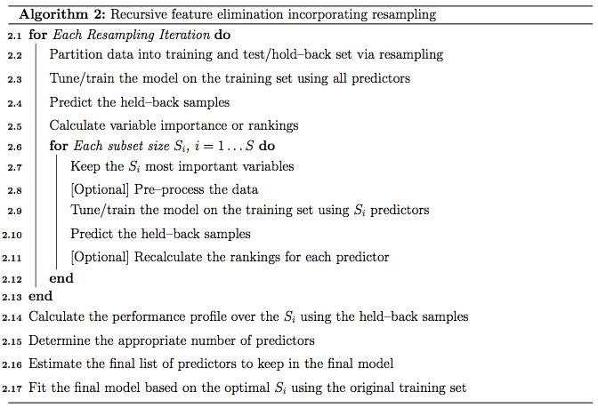
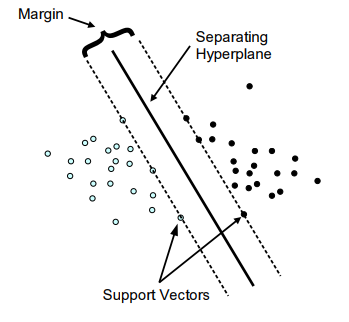
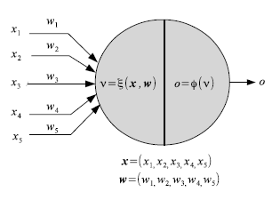
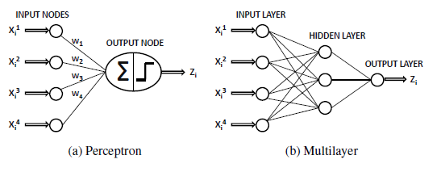
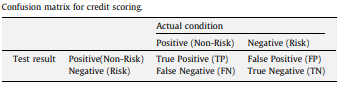

```{r include=FALSE}

# A Prefix nulling hook.

# Make sure to keep the default for normal processing.
default_output_hook <- knitr::knit_hooks$get("output")

# Output hooks handle normal R console output.
knitr::knit_hooks$set( output = function(x, options) {

  comment <- knitr::opts_current$get("comment")
  if( is.na(comment) ) comment <- ""
  can_null <- grepl( paste0( comment, "\\s*\\[\\d?\\]" ),
                     x, perl = TRUE)
  do_null <- isTRUE( knitr::opts_current$get("null_prefix") )
  if( can_null && do_null ) {
    # By default R print output aligns at the right brace.
    align_index <- regexpr( "\\]", x )[1] - 1
    # Two cases: start or newline
    re <- paste0( "^.{", align_index, "}\\]")
    rep <- comment
    x <- gsub( re, rep,  x )
    re <- paste0( "\\\n.{", align_index, "}\\]")
    rep <- paste0( "\n", comment )
    x <- gsub( re, rep,  x )
  }

  default_output_hook( x, options )

})

knitr::opts_template$set("kill_prefix"=list(comment=NA, null_prefix=TRUE))
```

```{r ,echo=FALSE}
knitr::opts_chunk$set(class.output='bg-primary')

```

<style>
body {
text-align: justify}
</style>


<br>

<style type="text/css">

h1.title {
  font-size: 35px;

}

</style>


<style>
p.comment {
background-color: #DBDBDB;
padding: 10px;
border: 1px solid black;
margin-left: 1px;
border-radius: 5px;
font-style: italic;
}

</style>


### *Abstract*
<p class="comment">

A **credit score** is a numerical expression based on a level analysis of a person's credit files, to represent the creditworthiness of an individual. Lenders, such as banks and credit card companies, use credit scores to evaluate the potential risk posed by lending money to consumers and to mitigate losses due to bad debt. Generally, financial institutions utilize it as a method to support the decision-making about credit applications. Both Machine learning (ML) and Artificial intelligence (AI) techniques have been explored for credit scoring  . Although there are no consistent conclusions on which ones are better, recent studies suggest combining multiple classifiers, i.e., ensemble learning, may have a better performance. In our study, using the [german credit data](https://archive.ics.uci.edu/ml/datasets/Statlog+(German+Credit+Data)) available on the UCI Machine Learning Repository we assessed the performance of different Machine learning techniques based on their overall accuracy, but not only, since we supported our results with accuracy measures such as AUC, F1-score, KS and Gini . Our findings suggest that random forest model with tuning parameters , support vector machine based on vanilladot Linear kernel function and lasso regression, with a good overall accuracy values lead us to the most performant AUC values, 0.7833 , 0.7794 and 0.7675,  respectively.
</p>


<br>
<br>

### I. Introduction


The purpose of credit scoring is to classify the applicants into two types : applicants with good credit and applicants with bad credits. When a bank receives a loan application , applicants with good credit have great possibility to repay financial obligation. Applicants with bad credit have high possibility of defaulting. The accuracy of credit scoring is critical to financial institutions profitability . Even 1% improvement on the accuracy of credit scoring of applicants with bad credit will decreases a great loss for financial institutions (Hand & Henley, 1997).

This study aims at adressing this classification problem by using the the applicant's demographic and socio-economic profiles of **german credit data** to examine  the risk of lending loan to the customer. We assessed the performance of different Machine learning algorithms (Logistic regression model , Decision tree, random forests, Support vector machines ,neural networks, Lasso ) in terms of overall accuracy. For the model optimization, we conducted a comparative assessment of different models combining the effects  of Gini, KS, F1-score, balanced accuracy and the area under the ROC curve (AUC) values.

The remainder of the report is organized as follow. In section 2, a general insight of the **Dataset** is presented, with a particular attention to the Data exploration. In section 3, we perform the **Data Pre-processing**. Section 4 explains the **Methods and Analysis** over  different Machine learning techniques we used and presents the metrics for the models performance evaluation,  while section 5 contains our main **Results**. Section 6 draws **Conclusions and suggestions**.


<br>


### II. Dataset 

<br>


####  <span style="color:red">2.1. Overview</span> 
<br>


`Loading library and data`


```{r ,message=FALSE,warning=FALSE,comment=NA,null_prefix=TRUE}

#library

library(tidyverse)
library(rchallenge)
library(caret)
library(RColorBrewer)
library(reshape2)
library(lattice)
library (rpart)
library(rpart.plot) 
library(rattle)
library(ROCR)
library(ggpubr)
library(ggthemes)
library(randomForest)
library(Information)
library(VIM)
library(Boruta)
library(e1071)
library(kernlab)
library(gridExtra)
library(nnet)
library(NeuralNetTools)
library(lars)
library(glmnet)
library(kableExtra)
library(doSNOW)
library(doParallel)
library(rmdformats)

#data
data("german")

#get class/glimpse of data
class(german)
glimpse(german)

```

The German Credit data is a dataset  provided by Dr. Hans Hofmann of the University of Hamburg. It's a publically available from the UCI Machine Learning repository at the following link: https://archive.ics.uci.edu/ml/datasets/Statlog+(German+Credit+Data). However, this dataset is also built-in  in some R packages, like [caret](https://topepo.github.io/caret/data-sets.html#german-credit-data) ,  [rchallenge](https://cran.r-project.org/web/packages/rchallenge/rchallenge.pdf) or [evtree](https://www.rdocumentation.org/packages/evtree/versions/1.0-7/topics/GermanCredit). We decided to use directly the german data from the rchallenge package , which is a transformed version of the GermanCredit dataset with factors instead of dummy variables.


Getting a glimpse of german data, we observe it's a data frame containing 21 variables for a total of 1,000 observations . The response variable (**or outcome,y**) in the dataset corresponds to the **Class** label, which is a binary variable indicating credit risk or credit worthiness with levels Good and Bad. Here, we are going to describe the 20 features and their characteristics:


***quantitative features***

-*Duration* : duration in months.

-*Amount*: credit Amount. 

-*InstallmentRatePercentage*: installment rate in percentage of disposable income.

-*ResidenceDuration*: present residence since .

-*Age* : Client's age.

-*NumberExistingCredits*:  number of existing credits at this bank.

-*NumberPeopleMaintenance*: number of people being liable to provide maintenance.


***qualitative features***

-*Telephone*: binary variable indicating if customer has a registered telephone number

-*ForeignWorker*: binary variable indicating if the customer is a foreign worker

-*CheckingAccountStatus*: factor variable indicating the status of checking account

-*CreditHistory*: factor variable indicating credit history

-*Purpose*: factor variable indicating the credit's purpose

-*SavingsAccountBonds*: factor variable indicating the savings account/bonds

-*EmploymentDuration*: ordered factor indicating the duration of the current employment

-*Personal*: factor variable indicating personal status and sex

-*OtherDebtorsGuarantors*: factor variable indicating Other debtors 

-*Property*: factor variable indicating the client's highest valued property

-*OtherInstallmentPlans*: factor variable indicating other installment plans

-*Housing*: factor variable indicating housing

-*Job*: factor indicating employment status

<br>
<br>

#### <span style="color:red">2.2. Data exploration</span>

<br>

First,summary statistics of the 21 variables are presented , out of which 7 are numerical attributes. Also, we can identify the various levels for the 14 categorical attributes including the outcome. 

```{r,comment=NA, null_prefix=TRUE}
summary(german)
```

<br>
<br>

##### **`outcome, y : Class`**

Visual exploration of the outcome, the credit worthiness, shows that there are more people with a good risk than a bad one. In fact, 70% of applicants have a good credit risk while about 30% have a bad credit risk .Then, class are unbalanced and for our subsequent analysis the data splitting in training set  and test set should be done with a stratified random sampling method.


```{r,warning=FALSE,message=FALSE}
#i create Class.prop, an object of Class 'tbl_df', 'tbl' and 'data.frame'.It contains the calculated relative frequencies or proportions for the levels Bad/Good of the credit worthiness in the german credit data.

Class.prop <- german %>% 
  count(Class) %>% 
  mutate(perc = n / nrow(german)) 
```

```{r, fig.align='center',out.width = '70%'}

# bar plot of credit worthiness

Class.prop %>%
 ggplot(aes(x=Class,y= perc,fill=Class))+
 geom_bar(stat="identity") +
 labs(title="bar plot",
      subtitle = "Credit worthiness",
      caption=" source: german credit data") +
  geom_text(aes(label=scales::percent(perc)), position = position_stack(vjust = 1.01))+
  scale_y_continuous(labels = scales::percent)+
  scale_fill_manual(values = c("Good" = "darkblue", "Bad" = "red"))
```

<br>
<br>

##### **`quantitative features`**.{.tabset .tabset-fade .tabset-pills}
<br>
Data exploration of numerical attributes disclosed the following insights:

* **Age** : From the age variable, we see that the median value for bad risk records is lesser than that of good records, it might be premature to say young people tend to have bad credit records, but we can safely assume it tends to be riskier.

* **Duration, Amount** :  Duration in months as well as credit Amount , appears to show higher median value for bad risk with respect to good risk. Also, the range of these two variables,  are more wide for the bad risk records than the good ones. When plotting their density curve along the vertical line for their mean value, we observe that neither Duration in months nor Amount credit  is normally distributed. Data tends to show a right skewed distribution especially for the Amount credit variable.

* **InstallmentRatePercentage** : The bar plot of installment rate shows a significant difference between good and bad credits risk . The number of good records seem to be the double of bad records.  When we look at the Box plot, it reveals that the median value for bad records is higher than  the good ones even if the two Classes appear to have the same range. 

* **NumberExistingCredits, ResidenceDuration,  NumberPeopleMaintenance** : we almost bring up a  similar observation for these attributes. While they have their two credit worthiness class "good/bad" which seem to show the same range( cf. boxplot) , good records are always higher than the bad ones(cf bar plot). When we compare some of descriptive statistics of two risks for each of these variable, we  observe how  mean, median, and sd are almost equal.

 

<br>
<br>


###### client's Age

```{r, fig.align='center',warning=FALSE,message=FALSE, out.width = '70%'}

ggplot(melt(german[,c(5,21)]), aes(x = variable, y = value, fill = Class)) + 
  geom_boxplot() +
  xlab("Class") +
  ylab("Age") +
  labs(title="Box plot", subtitle="client's age grouped by credit worthiness", caption = "source: german credit data") +
  scale_fill_manual(values = c("Good" = "darkblue", "Bad" = "red"))
```

###### Duration in months


```{r, fig.align='center',warning=FALSE,message=FALSE,out.width = '70%'}

avg.duration <- german %>%
  select(Duration, Class) %>%
  group_by(Class) %>%
  summarise(m=mean(Duration))

german%>% 
  ggplot(aes(Duration))+
  geom_density(aes(fill=Class),alpha=0.7) + 
  geom_vline(data=avg.duration,aes(xintercept= m , colour= Class), lty = 4 ,size=2)+
  labs(title="Density plot", 
       subtitle="Duration in months grouped by credit worthiness",
       caption="Source: german credit data",
       x="Duration",
       fill="Class") +
  scale_fill_manual(values = c("Good" = "darkblue", "Bad" = "red"))

ggplot(reshape2::melt(german[,c(1,21)]), aes(x = variable, y = value, fill = Class)) + 
  geom_boxplot() +
  xlab("Class") +
  ylab("Duration") +
  labs(title="Box plot", subtitle="Duration in months grouped by credit worthiness", caption = "source: german credit data") +
  scale_fill_manual(values = c("Good" = "darkblue", "Bad" = "red"))

```

###### credit Amount

```{r, fig.align='center',warning=FALSE,message=FALSE,out.width = '70%'}

avg.amount <- german %>%
  select(Amount, Class) %>%
  group_by(Class) %>%
  summarise(m=mean(Amount))

german%>% 
  ggplot(aes(Amount))+
  geom_density(aes(fill=Class),alpha=0.7) + 
  geom_vline(data=avg.amount,aes(xintercept= m , colour= Class), lty = 4 ,size=2)+
  labs(title="Density plot", 
       subtitle="credit amount grouped by credit worthiness",
       caption="Source: german credit data",
       x="Amount",
       fill="Class") +
  scale_fill_manual(values = c("Good" = "darkblue", "Bad" = "red"))

  
ggplot(reshape2::melt(german[,c(2,21)]), aes(x = variable, y = value, fill = Class)) + 
  geom_boxplot() +
  xlab("Class") +
  ylab("Amount") +
  labs(title="Box plot", subtitle="credit amount grouped by credit worthiness", caption = "source: german credit data") +
  scale_fill_manual(values = c("Good" = "darkblue", "Bad" = "red"))

```


###### Installment rate


```{r, fig.align='center',warning=FALSE,message=FALSE,out.width = '70%'}

german %>% 
  ggplot(aes(InstallmentRatePercentage, ..count..)) + 
  geom_bar(aes(fill=Class), position ="dodge")+
  labs(title="bar plot", subtitle="InstallmentRatePercentage grouped by credit worthiness", caption = "source: german credit data") +
  scale_fill_manual(values = c("Good" = "darkblue", "Bad" = "red"))

  
ggplot(reshape2::melt(german[,c(3,21)]), aes(x = variable, y = value, fill = Class)) + 
  geom_boxplot() +
  xlab("Class") +
  ylab("Install_rate_perc") +
  labs(title="Box plot", subtitle="InstallmentRatePercentage grouped by credit worthiness", caption = "source: german credit data") +
  scale_fill_manual(values = c("Good" = "darkblue", "Bad" = "red"))


```


###### NumberExistingCredits

```{r, fig.align='center',warning=FALSE,message=FALSE,out.width = '70%',comment=NA, null_prefix=TRUE}

# we just report here barplot/boxplot for the attribute NumberExistingCredits,
# but we show descriptive statistics including also NumberPeopleMaintenance and  #ResidenceDuration. To produce their barplot and boxplot , just repeat the code below and replace with their variable name.

german %>% 
  ggplot(aes(NumberExistingCredits, ..count..)) + 
  geom_bar(aes(fill=Class), position ="dodge")+
  labs(title="bar plot", subtitle="Number of existing credits grouped by credit worthiness", caption = "source: german credit data") +
  scale_fill_manual(values = c("Good" = "darkblue", "Bad" = "red"))

  
ggplot(reshape2::melt(german[,c(6,21)]), aes(x = variable, y = value, fill = Class)) + 
  geom_boxplot() +
  xlab("Class") +
  ylab("n_credits") +
  labs(title="Box plot", subtitle="Number of existing credits grouped by credit worthiness", caption = "source: german credit data") +
  scale_fill_manual(values = c("Good" = "darkblue", "Bad" = "red"))

# Compare mean, median and sd of two Class  for each of these attributes

german%>% group_by(Class) %>% 
  summarize(ncredits.mean=mean(NumberExistingCredits), 
            ncredits.median=median(NumberExistingCredits), 
            ncredits.sd = sd(NumberExistingCredits))

german%>% group_by(Class) %>% 
  summarize(resid_dur.mean=mean(ResidenceDuration), 
            resid_dur.median=median(ResidenceDuration), 
            resid_dur.sd = sd(ResidenceDuration))

german%>% group_by(Class) %>% 
  summarize(people_maint.mean=mean(NumberPeopleMaintenance), 
            people_maint.median=median(NumberPeopleMaintenance), 
            people_maint.sd = sd(NumberPeopleMaintenance))

```


#####

<br>
<br>

In the following DT table, we can interactively visualize all numerical attributes and our response variable, credit worthiness (Class) . We can search / filter any keywords or specific entries  for each variable.

```{r, warning=FALSE, message=FALSE}

# i create a dataframe "get_num" which contains all numerical attributes plus the response variable. Then, with the function datatable of DT library , i create HTML widget to display get_num.

get_num <-  select_if(german, is.numeric)
get_num <- get_num %>% 
  mutate(Class = german$Class)
DT::datatable(get_num,rownames = FALSE, filter ="top", options =list(pageLength=10,scrollx=T))


```

<br>
<br>

##### **`qualitative features`**.{.tabset .tabset-fade .tabset-pills}
<br>
Data exploration of categorical attributes disclosed the following insights:

* **CheckingAccountStatus** : the current status of the checking account matters as the frequency of the response variables is seen to differ from one sub category to another. Accounts with less than 0 DM houses more number of bad credit risk records while  accounts with more than 200 DM the least.we see how applicants with  no checking account house the highest number of good records. ( NB: DM -> Deutsche Mark)

* **CreditHistory**: Generally, credit history's levels tend to show  a higher number of good credit risk  than bad credit risk. We observe that proportion of the response variable ,the credit worthiness, changes varies significantly. For categories "NoCredit.AllPaid" and "ThisBank.AllPaid ", we see how the number of bad credit records are greater.

* **Purpose**: For the purpose variable, we observe that the proportion of good and bad credit risk varies significantly across the different credit's purposes. While the majority of categories show number of good risk records always greater than the bad ones, the categories as  DomesticAppliance ,Education , Repairs and others seem to include more risky records. ( the difference between the number of bad and good records is really minimal)  (see histogram and ballon plot)

* Generally, for the other categorical attributes, we observe a similar trend for which good creditworthiness records are greater than bad ones. Variables like SavingAccountBonds, EmploymentDuration, Personal, ForeignWorker, Housing, Property, or Telephone straightly follow that observation. However, the trend looks more significant for the attributes **SavingAccountBonds**, telephone,foreign workers, or also EmploymentDuration. Instead, the two features ***OtherInstallmentPlans*** and ***OtherDebtorsGuarantors*** show more risky records. (see on barplot levels Coapplicant or Guarantor for OtherDebtors , and Stores or Bank for OtherInstall) 


<br>


###### CheckingAccountStatus

```{r, fig.align='center',warning=FALSE,message=FALSE,out.width = '70%'}

ggplot(german, aes(CheckingAccountStatus, ..count..)) + 
  geom_bar(aes(fill = Class), position = "dodge") +
  labs(title="bar plot", subtitle="AccountStatus grouped by credit worthiness", caption = "source: german credit data") +
  scale_fill_manual(values = c("Good" = "darkblue", "Bad" = "red"))

```

###### CreditHistory

```{r, fig.align='center',warning=FALSE,message=FALSE,out.width = '70%'}

german %>% 
  ggplot(aes(CreditHistory, ..count..)) + 
  geom_bar(aes(fill=Class), position ="dodge") +
  labs(title="bar plot", subtitle="Credit history grouped by credit worthiness", caption = "source: german credit data") +
  scale_fill_manual(values = c("Good" = "darkblue", "Bad" = "red"))

```


###### Purpose

```{r, fig.align='center',warning=FALSE,message=FALSE,out.width = '70%'}

german %>% 
  ggplot(aes(Purpose)) +
  geom_bar(aes(fill=Class), width = 0.5) + 
  theme(axis.text.x = element_text(angle=65, vjust=0.6)) + 
  labs(title="Histogram", 
       subtitle="credit purpose across credit worthiness",
       caption = "source: german credit data") +
  scale_fill_manual(values = c("Good" = "darkblue", "Bad" = "red"))


purp <- table(german$Purpose,german$Class)

ggballoonplot(as.data.frame(purp), fill = "value",title="Ballon plot",
              subtitle="credit purpose across credit worthiness",
              caption = "source: german credit data")+
scale_fill_viridis_c(option = "C") 

```


###### SavingsAccountBonds

```{r, fig.align='center',warning=FALSE,message=FALSE,out.width = '70%'}
german %>% 
  ggplot(aes(SavingsAccountBonds, ..count..)) + 
  geom_bar(aes(fill=Class), position ="dodge") +
  labs(title="bar plot", subtitle="Saving accounts grouped by credit worthiness", caption = "source: german credit data") +
  scale_fill_manual(values = c("Good" = "darkblue", "Bad" = "red"))

```

###### EmploymentDuration

```{r, fig.align='center',warning=FALSE,message=FALSE,out.width = '70%'}
german %>% 
  ggplot(aes(EmploymentDuration, ..count..)) + 
  geom_bar(aes(fill=Class), position ="dodge") +
  labs(title="bar plot", subtitle="Employment Duration grouped by credit worthiness",    caption = "source: german credit data") +
  scale_fill_manual(values = c("Good" = "darkblue", "Bad" = "red"))
```


###### ForeignWorker

```{r, fig.align='center',warning=FALSE,message=FALSE,out.width = '70%'}
german %>% 
  ggplot(aes(ForeignWorker, ..count..)) + 
  geom_bar(aes(fill=Class), position ="dodge") +
  labs(title="bar plot", subtitle="Foreignworker grouped by credit worthiness", caption = "source: german credit data") +
  scale_fill_manual(values = c("Good" = "darkblue", "Bad" = "red"))
```
  
###### Telephone

```{r, fig.align='center',warning=FALSE,message=FALSE,out.width = '70%'}  
german %>% 
  ggplot(aes(Telephone, ..count..)) + 
  geom_bar(aes(fill=Class), position ="dodge")+
  labs(title="bar plot", subtitle="Telephone grouped by credit worthiness", caption = "source: german credit data") +
  scale_fill_manual(values = c("Good" = "darkblue", "Bad" = "red"))
```


###### OtherInstallmentPlans

```{r, fig.align='center',warning=FALSE,message=FALSE,out.width = '70%'}
german %>% 
  ggplot(aes(OtherInstallmentPlans, ..count..)) + 
  geom_bar(aes(fill=Class), position ="dodge")+
  labs(title="bar plot", subtitle="OtherInstallmentPlans grouped by credit worthiness",   caption = "source: german credit data") +
  scale_fill_manual(values = c("Good" = "darkblue", "Bad" = "red"))

```


###### OtherDebtorsGuarantor

```{r, fig.align='center',warning=FALSE,message=FALSE,out.width = '70%'}
german %>% 
  ggplot(aes(OtherDebtorsGuarantors, ..count..)) + 
  geom_bar(aes(fill=Class), position ="dodge")+
  labs(title="bar plot", subtitle="OtherDebtorsGuarantors grouped by credit worthiness", caption = "source: german credit data") +
  scale_fill_manual(values = c("Good" = "darkblue", "Bad" = "red"))

```


#####

<br>
<br>

In the following DT table, we can interactively visualize all categorical features and our response variable, credit worthiness (Class) . We can search / filter any keywords or specific entries  for each variable.

```{r, warning=FALSE, message=FALSE}

# i create a dataframe "get_cat" which contains all categorical attributes including the response variable. Then, with the function datatable of DT library , i create HTML widget to display get_num.

get_cat <- select_if(german, is.factor)
DT::datatable(get_cat,rownames = FALSE, filter ="top", options =list(pageLength=10,scrollx=T))

```

<br>
<br>

##### **`Multivariate analysis`**.{.tabset .tabset-fade .tabset-pills}
<br>
Relationship between quantitative and qualitative features, it's performed to understand interactions between different fields in the dataset or finding interactions between variables more than 2  (- ex: pair plot and 3D scatter plot). We performed Multi-panel conditioning  focusing on the relationship between Age , Amount credit with respect to Purpose and Personal status/sex  (i1 , i2) , we also drew a histogram plot of Amount ~ Age conditioned on Personal status/sex variable (i3).


As in Sivakumar(2015), Multivariate data analysis of the latter revealed the following:

* (i1), **Age vs credit amount for various purpose** : As we can see in the first plot ,most of the loans are sought to buy: new car , furniture/equipment, radio/television. It also reveals that surprisingly few people buying used cars have bad rating! And not surprisingly, lower the age of the lonee and higher loan amount correlates to bad credits.

* (i2), **Age vs credit Amount for Personal status and sex** :
Male: the second plot reveals that single males tend to borrow more, and as before, younger they are and higher the loan amount corresponds to a bad rating. Instead, married/widowed or divorced/separated Males have shown the least amount of borrowing. Because of this, its difficult to visually observe any trends in these categories.
Female: the first obvious observation for females is the absence of data for single women. Its not sure if its lack of data or there were no single women applying for loans- though the second possibility seems unlikely in real life. The next most borrowing after single males category is Female not single :divorced/separated/married. The dominant trend in this category is smaller loan amount, higher the age, better the credit rating.


* (i3), **Distribution Amount ~ Age conditioned on Personal status/sex** :The histogram reveals that there is a right skewed nearly normal trend seen across all Personal Status and Sex categories, with 30 being the age where people in the sample seem to be borrowing the most.


<br>


###### Age vs credit amount for various purpose

```{r, fig.align='center',warning=FALSE,message=FALSE}

mycol <- c("red","blue")

xyplot(Amount ~ Age|Purpose, german,
       grid = TRUE, 
       group= Class,
       auto.key = list(points = TRUE, rectangles = FALSE, title="Class",cex=0.7, space = "right"),
       main=list(
         label="Age vs credit amount for various purposes\n grouped by credit worthiness",
         cex=1),
         sub= "source: german credit data",
       par.settings = c(simpleTheme(col = mycol),list(par.sub.text = list(cex = 0.7, col = "black",x=0.75))))

```

###### Age vs credit Amount for Personal status and sex

```{r, fig.align='center',warning=FALSE,message=FALSE}

xyplot(Amount ~ Age |Personal , german,
       group = Class,
       grid = TRUE,
       auto.key = list(points = TRUE, rectangles = FALSE, title="Class",cex=0.7, space = "right"),
       main=list(
         label="Age vs credit amount for Personal status and sex\n grouped by credit worthiness",
         cex=1),
         #sub= "source: german credit data"),
         sub= "source: german credit data",
       par.settings = c(simpleTheme(col = mycol),list(par.sub.text = list(cex = 0.7, col = "black",x=0.75))))

```


###### Distribution Amount ~ Age conditioned on Personal status/sex 

```{r, fig.align='center',warning=FALSE,message=FALSE}

histogram(Amount ~ Age | Personal, 
          data = german, 
          xlab = "Age",
          ylab= "Amount",
          main= list( label="Distribution of Age and Personal status & sex", cex=1),
          col="purple",
          sub= "source: german credit data",
          par.settings=list(par.sub.text = list(cex = 0.7, col = "black", x=0.75)))

```

#####


<br>
<br>


### III. Data Preprocessing
<br>
Real-life data typically needs to be preprocessed (e.g. cleansed, filtered, transformed) in order to be used by the machine learning techniques in the analysis step.

Credit scoring portfolios are frequently voluminous and they are in the range of several thousand, well over 100000 applicants measured on more than 100 variables are quite common (Hand and Hen ley 1997). These portfolios are characterized by noise, missing values, complexity of distributions and by redundant or irrelevant features (Piramuthu 2006). Clearly, the applicants characteristics will vary from situation to situation: an applicant looking for a small loan will be asked for different information from another who is asking for a big loan. Also, according to Garcia et al(2012), in credit scoring applications the resampling approaches have produced [important gains in performance when compared to the use of the imbalanced data sets](https://www.researchgate.net/publication/233399251_Improving_Risk_Predictions_by_Preprocessing_Imbalanced_Credit_Data)

Then in this section, we'll focus  mainly on data preprocessing techniques that are of particular importance when performing a credit scoring task. These techniques include Data wrangling( cleansing, filtering, renaming variables, recodifing factors,etc ) , Features selection(filter,wrapper methods) and Data partitioning (stratified random sampling method to correct the imbalanced class).

<br>


#### <span style="color:red">3.1. Data Wrangling</span>

To perform the different steps of data pre-processing part and successive analysis , we make a copy of the german credit dataset,  in order to  to keep unchanged our original german credit data .

```{r}
german.copy <- german
```

> **3.1.1. `Missing values`**

We used the VIM package to explore the data and the structure of the missing or imputed values. Fortunately, We observe that there are no missing values. It's confirmed not only by the *proportion of missings plot* , but also by the *variable sorted by number of missings* output, where each variable have a null count.

If they were missing values, it would be presented with red cells like the case of german credit risk from kaggle downloaded at this [link](https://www.kaggle.com/uciml/german-credit#german_credit_data.csv)  (see second plot)

```{r,comment=NA, null_prefix=TRUE, warning=FALSE, message=FALSE}

#aggr function : Calculate or plot the amount of missing/imputed values in each variable and the amount of missing/imputed values in certain combinations of variables.

missing.values <- aggr(german.copy, sortVars = T, prop = T, sortCombs = T,
                       cex.lab = 1.5, cex.axis = .6, cex.numbers = 5,
                       combined = F, gap = -.2)
```


```{r,comment=NA, null_prefix=TRUE, warning=FALSE, message=FALSE}

#german credit data from kaggle

GCD <- read.csv(file="german_credit_data.csv", header=TRUE, sep=",")

germanKaggle_NA <- aggr(GCD, sortVars = T, prop = T, sortCombs = T,
                       cex.lab = 1.5, cex.axis = .6, cex.numbers = 5,
                       combined = F, gap = -.2)
```


> **3.1.2. `Renaming variables`**

Renaming data columns is a common task in Data pre-processing that can make implementing ML algorithms/ writing code faster by using short, intuitive names. The dplyr function rename() makes this easy.

```{r,message=FALSE,warning=FALSE,comment=NA,null_prefix=TRUE}
#rename(data, new_name = `old_name`)

german.copy = rename( german.copy,
                      Risk = `Class`,
                      installment_rate = `InstallmentRatePercentage`,
                      present_resid = `ResidenceDuration`,
                      n_credits = `NumberExistingCredits`,
                      n_people = `NumberPeopleMaintenance`,
                      check_acct = `CheckingAccountStatus`,
                      credit_hist = `CreditHistory`,
                      savings_acct = `SavingsAccountBonds`,
                      present_emp = `EmploymentDuration`, 
                      status_sex = `Personal`,
                      other_debt = `OtherDebtorsGuarantors`,
                      other_install = `OtherInstallmentPlans`
                     )

#get glimpse of data

glimpse(german.copy)
```


> **3.1.3. `Skewness`**

Skewness is defined to be the [third standardized central moment](https://en.wikipedia.org/wiki/Standardized_moment) .You can easily tell if a distribution is skewed by simple visualization. There are different ways may help to remove skewness such as log, square root or inverse. However it is often difficult to determine from plots which transformation is most appropriate for correcting skewness. The Box-Cox procedure automatically identified a transformation from the family of power transformations that are indexed by a parameter $\lambda$.

This family includes: 
   
* log transformation $(\lambda=0)$
* square transformation $(\lambda=2)$
* square root $(\lambda=0.5)$
* inverse $(\lambda= -1)$

We used preProcess() function in caret to apply this transformation by changing the method argument to **BoxCox**.

```{r,message=FALSE,warning=FALSE}
mySkew <- preProcess(german.copy, method = c("BoxCox"))
mySkew
mySkew$method
mySkew$bc
```

We visually inspected the skewness by plotting histogram of the 6 numerical attributes inclined to a BoxCox transformation ( see mySkew$method)

```{r,message=FALSE,warning=FALSE ,fig.align='center'}
p1<- german.copy %>% 
  ggplot(aes(x=Amount)) + 
  geom_histogram(aes(y=..density..),    # Histogram with density 
                 binwidth=1000,
                 colour="black", fill="white") +
  geom_density(alpha=.5, fill="purple") +  # Overlay with transparent density plot
  labs(title= "Histogram of Amount", subtitle= "overlaid with kernel density curve", caption = "source:german credit data")
 

p2<- german.copy %>% 
  ggplot(aes(x=installment_rate)) + 
  geom_histogram(aes(y=..density..),    # Histogram with density 
                 binwidth=.5,
                 colour="black", fill="white") +
  geom_density(alpha=.5, fill="purple") +  # Overlay with transparent density plot
  labs(title= "Histogram of installment rate percentage", subtitle= "overlaid with kernel density curve", caption = "source:german credit data")

p3 <-  german.copy %>%
  ggplot(aes(x=Duration)) + 
  geom_histogram(aes(y=..density..), # Histogram with density instead y-axis count
                 binwidth=5,
                 colour="black", fill="white") +
  geom_density(alpha=.5, fill="purple") +  # Overlay with transparent density plot
  labs(title= "Histogram of Duration in months", subtitle= "overlaid with kernel density curve", caption = "source:german credit data")


p4 <-  german.copy %>%
  ggplot(aes(x=n_credits)) + 
  geom_histogram(aes(y=..density..),      
                 binwidth=1,
                 colour="black", fill="white") +
  geom_density(alpha=.5, fill="purple") +  # Overlay with transparent density plot
  labs(title= "Histogram of number of existing credits", subtitle= "overlaid with kernel density curve", caption = "source:german credit data")

p5 <-  german.copy %>%
  ggplot(aes(x=Age)) + 
  geom_histogram(aes(y=..density..), # Histogram with density instead of count on y-axis
                 binwidth=5,
                 colour="black", fill="white") +
  geom_density(alpha=.5, fill="purple") +  # Overlay with transparent density plot
  labs(title= "Histogram of Age", subtitle= "overlaid with kernel density curve", caption = "source:german credit data")

p6 <-  german.copy %>%
  ggplot(aes(x=present_resid)) + 
  geom_histogram(aes(y=..density..),
                 binwidth=1,
                 colour="black", fill="white") +
  geom_density(alpha=.5, fill="purple") +  # Overlay with transparent density plot
  labs(title= "Histogram of residence duration", subtitle= "overlaid with kernel density curve", caption = "source:german credit data")

#plot all 
grid.arrange(p1, p3, p2, p4, p5, p6, ncol=3)

```    
  
The previous plots confirm the skweness distributions of 6 numerical attributes inclined to a BoxCox transformation. More over, The output of *mySkew*, the applied BoxCoxTrans , shows the sample size (1000), number of variables (20) and the $λ$ estimates for Box-Cox transformation candidate variables (6).

**Do we have to apply a transformation/ is it useful to resolve skewness for the purpose of our work?** : The output of **mySkew$bc** reveals that the Amount (1.94) , n_credits (1.27) and Duration (1.09) attributes have the higher values of skweness and precises that Lambda = 0 will be used for transformations for Amount and Duration attributes . Numerical features such as n_credits, present_resid, Age, Duration are seen more as discrete variables. The Amount attribute remains the only good candidate to apply a log transformation. 

predict() method applies the results to a data frame myTransformed. 
In the latter,we can find the transformed Amount variable and other BoxCox transformatons applied to the other numerical attributes. We'll take it account for our successive analysis **only if necessary**.


```{r,comment=NA, null_prefix=TRUE, message=FALSE,warning=FALSE ,fig.align='center',out.width = '70%'}

myTransformed <- predict(mySkew, german.copy)
glimpse(myTransformed)

p1_new <- myTransformed %>% 
  ggplot(aes(x=Amount)) + 
  geom_histogram(aes(y=..density..),
                 binwidth=.5,
                 colour="black", fill="white") +
  geom_density(alpha=.5, fill="purple") +  # Overlay with transparent density plot
  labs(title= "Histogram of Amount", subtitle= "overlaid with kernel density curve", 
       caption = "source: my transformed german data with no Skewness")

p1_new 
```

Before to continue with the Feature selection step, we are going to recode the response variable **Risk**, by creating a new variable (numerical) **risk_bin** where **0** corresponds to a Bad credit worthiness and **1** to a Good credit worthiness. We didn't eliminate the original Risk outcome , they can be both useful for successive analysis depending of the Machine learning model we'll test.

```{r, message=FALSE,warning=FALSE ,fig.align='center'}

german.copy <- german.copy %>%
  mutate(risk_bin = ifelse(Risk == "Bad",0,1))

```

<br>

#### <span style="color:red">3.2. Features selection</span>

According to HA & Nguyen (2016),  there are two different categories of feature selection methods: filter and wrapper methods.


> **3.2.1. `filter methods`**

The filter approach considers the feature selection process as a precursor stage of learning algorithms. The filter model uses evaluation functions to evaluate the classification performances of subsets of features. There are many evaluation functions such as feature importance, Gini, information gain, filtering, etc. A disadvantage of this approach is that there is no direct relationship between the feature selection process and the performance of learning algorithms. 

* **sbf (selection by filtering, caret package):**


The caret function sbf (for selection by filter) can be used to cross-validate such feature selection schemes. It's a part of Univariate filters .They pre-screen the predictors using simple univariate statistical methods.As an example, it has been suggested for classification models, that predictors can be filtered by conducting some sort of k-sample test (where k is the number of classes) to see if the mean of the predictor is different between the classes. Wilcoxon tests, t-tests and ANOVA models are sometimes used. Predictors that have statistically significant differences between the classes are then used for modeling.For more details, read [this](http://topepo.github.io/caret/feature-selection-using-univariate-filters.html#univariate-filters)

```{r,message=FALSE,warning=FALSE}

filterCtrl <- sbfControl(functions = rfSBF, method = "repeatedcv", repeats = 5)

set.seed(1)
rfWithFilter <- sbf( Risk ~ ., german.copy[,-22], sbfControl = filterCtrl)
rfWithFilter
```

The output of Model fitting after applying sbf univariate filters tell us that the top 5 selected variables are : Age (100%), Amount (100%), check_acct0.to.200 (100%), check_acctnone (100%), credit_histCritical (100%).Let's try another method to assert or rebut the latter findings.

<br>

* **WOE,IV (Information package) :** 


**Weight of Evidence(WOE)**: WOE shows predictive power of an independent variable in relation to dependent variable. It evolved with credit scoring to magnify separation power between a good customer and a bad customer, hence it is one of the measures of separation between two classes(good/bad, yes/no, 0/1, A/B, response/no-response). It is defined as: $$WOE = ln(\frac{Distribution.of.nonEvents(Good)}{Distribution.of.Events(Bad)})$$ .It is computed from the basic odds ratio: (Distribution of Good Credit Outcomes) / (Distribution of Bad Credit Outcomes)

Some benefits of WOE lie in the fact that it can treat outliers (Suppose you have a continuous variable such as annual salary and extreme values are more than 500 million dollars. These values would be grouped to a class of (let's say 250-500 million dollars). Later, instead of using the raw values, we would be using WOE scores of each classes.) and handle missing values as missing values can be binned separately. Also, It handles both continuous and categorical variables so there is no need for dummy variables.  

**Information value(IV)**: Information value is one of the most useful technique to select important variables in a predictive model. It helps to rank variables on the basis of their importance. The IV is calculated using the following formula : $$IV =\sum(\%nonEvents - \%events)* WOE$$

According to Siddiqi (2006), by convention the values of the $IV$ statistic in credit scoring can be interpreted as follows.

If the $IV$ statistic is:

* Less than 0.02, then the predictor is not useful for modeling (separating the Goods from the Bads)
* 0.02 to 0.1, then the predictor has only a weak relationship to the Goods/Bads odds ratio
* 0.1 to 0.3, then the predictor has a medium strength relationship to the Goods/Bads odds ratio
* 0.3 to 0.5, then the predictor has a strong relationship to the Goods/Bads odds ratio.
* greater than 0.5, suspicious relationship (Check once)


```{r,message=FALSE,warning=FALSE}
IV <- create_infotables(data=german.copy[,-21], NULL, y="risk_bin", bins=10) 
IV$Summary$IV <- round(IV$Summary$IV*100,2)

#get tables from the IV statistic
IV$Tables
```

```{r,message=FALSE,warning=FALSE,comment=NA, null_prefix=TRUE}
#get summary of the IV statistic
IV$Summary
```

We observed that following variables do not have prediction power - very very weak predictor (IV< 2%), hence we shall exclude them from modeling:

```{r,message=FALSE,warning=FALSE,comment=NA, null_prefix=TRUE}
kable(IV$Summary %>%
        filter(IV < 2))
```
<br>

Second group of variables are very weak predictors (2%<=IV< 10%), hence we may or may not include them while modeling

```{r,message=FALSE,warning=FALSE,comment=NA, null_prefix=TRUE}
kable(IV$Summary %>%
        filter(IV >= 2 & IV < 10 ))
```
<br>

Third group of variables have medium prediction power (10%<=IV< 30%), hence we will include them in modeling as we have less number of variables

```{r,message=FALSE,warning=FALSE,comment=NA, null_prefix=TRUE}
kable(IV$Summary %>%
        filter(IV >= 10 & IV < 30 ))
```
<br>

There is no strong predictor with IV between 30% to 50%

```{r,message=FALSE,warning=FALSE,comment=NA, null_prefix=TRUE}
kable(IV$Summary %>%
        filter(IV >= 30 & IV < 50 ))
```

<br>

check_acct has a very high prediction power (IV > 50%), it could be suspicious and require further investigation.

```{r,message=FALSE,warning=FALSE,comment=NA, null_prefix=TRUE}
kable(IV$Summary %>%
        filter( IV > 50 ))
```

<br>

> **3.2.2. `wrapper methods`**

Wrapper methods consider the selection of a set of features as a search problem, where different combinations are prepared, evaluated and compared to other combinations. A predictive model us used to evaluate a combination of features and assign a score based on model accuracy. The search process may be methodical such as a best-first search, it may stochastic such as a random hill-climbing algorithm, or it may use heuristics, like forward and backward passes to add and remove features. One disadvantage of the wrapper approach is highly computational cost.

An example of a wrapper method is the recursive feature elimination algorithm. Another example is the boruta algorithm. 


* **rfe (recursive feature elimination, caret package):**

Recursive feature elimination via the caret package, is a wrapper method which is explained by the algorithm below. For further details follow [Recursive Feature Elimination via caret](https://topepo.github.io/caret/recursive-feature-elimination.html#rfe)

```{r,echo=FALSE, fig.cap="recursive feature elimitation algorithm", fig.align='center',out.width = '70%'}


```
<br>

We created a function called "**recur.feature.selection**" which internally defined :  x, the data frame of predictor variables ; y, the  vector (numeric or factor) of outcome (y) ;  sizes, an integer vector for the specific subset sizes that should be tested, and a list of options that can be used to specify the model and the methods for prediction(using rfecontrol). Then we applied the algorithm using the rfe function.


```{r,message=FALSE,warning=FALSE,comment=NA, null_prefix=TRUE}

recur.feature.selection <- function(num.iters=20, features.var, outcome.var){
set.seed(10)
sizes.var <- 1:20
control <- rfeControl(functions = rfFuncs, #pre-defined sets of functions,randomForest(rffuncs)
                        method = "cv",
                        number = num.iters,
                        returnResamp = "all",
                        verbose = FALSE
                        )
results.rfe <- rfe(x = features.var, 
                   y = outcome.var,
                   sizes = sizes.var,
                   rfeControl = control)
return(results.rfe)
}
```


```{r,message=FALSE,warning=FALSE}
#before to apply the rfe algorithm, i clear unusued memory
invisible(gc())
```


```{r,message=FALSE,warning=FALSE}

#To resolve the summary.connection(connection) : invalid connection, i install the doSnow-parallel-DeLuxe R script performed by Tobias Kind (2015); see more here : https://github.com/tobigithub/R-parallel/wiki/R-parallel-Errors

source("Install-doSNOW-parallel-DeLuxe.R") 

#i remove in the features.var (both Risk (21) and risk_bin (22))  /  i keep only Risk (factor) as outcome var.

rfe.results <- recur.feature.selection(features.var = german.copy[,c(-21,-22)],   
                                       outcome.var = german.copy[,21])    

# view results
rfe.results

```

The recursive feature selection output (Outer resampling method: Cross-Validated (20 fold) ) shows that the top 5 variables are:  check_acct, Duration, credit_hist, Amount and savings_acct. These findings are somehow in line  with those of WOE and IV statistics. ( check_acct has the highest power prediction, and features such as Amount,Duration, savings_acct have medium prediction power)

<br>


* **Boruta algorithm : **


Boruta algorithm is a wrapper built around the random forest classification algorithm implemented in the R package randomForest (Liaw and Wiener, 2002). It tries to capture all the important, interesting features you might have in your dataset with respect to an outcome variable. As explained in Kursa & Rudnicki (2010), the steps of the boruta algorithm can be resume as follow:

* First, it duplicates the dataset, and shuffle the values in each column. These values are called shadow features. Then, it trains a classifier, such as a Random Forest Classifier, on the dataset. By doing this, you ensure that you can an idea of the importance -via the Mean Decrease Accuracy or Mean Decrease Impurity- for each of the features of your data set. The higher the score, the better or more important.
* Then, the algorithm checks for each of your real features if they have higher importance. That is, whether the feature has a higher Z-score than the maximum Z-score of its shadow features than the best of the shadow features. If they do, it records this in a vector. These are called a hits. Next,it will continue with another iteration. After a predefined set of iterations, you will end up with a table of these hits.
* At every iteration, the algorithm compares the Z-scores of the shuffled copies of the features and the original features to see if the latter performed better than the former. If it does, the algorithm will mark the feature as important. In essence, the algorithm is trying to validate the importance of the feature by comparing with random shuffled  copies, which increases the robustness. This is done by simply comparing the number of times a feature did better with the shadow features using a binomial distribution.
* If a feature hasn't been recorded as a hit in say 15 iterations, you reject it and also remove it from the original matrix. After a set number of iterations -or if all the features have been either confirmed or rejected- you stop.


```{r,message=FALSE,warning=FALSE,comment=NA, null_prefix=TRUE}
set.seed(123)
Boruta.german <- Boruta(Risk ~ . , data = german.copy[,-22], doTrace = 0, ntree = 500)
Boruta.german

#Functions which convert the Boruta selection into a formula which returns only Confirmed attributes.
getConfirmedFormula(Boruta.german)

```

Boruta function uses y the response vector as factor . Then in the formula, we should consider Risk and not risk_bin. We observed that Boruta performed 99 iterations in 2.055356 mins, and the confirmed important attributes are 11 : Duration , Amount , Age , check_acct , credit_hist , Purpose ,  savings_acct , present_emp , other_debt , Property and other_install (results that go in accordance with WOE and IV statistics, from weak to highest predictors) . See the plot below, where Blue boxplots correspond to minimal, average and maximum Z score of a shadow attribute. Red and green boxplots represent Z scores of respectively rejected and confirmed attributes. Yellow boxplots represent Z scores of 5 tentative attributes left.

```{r,message=FALSE,warning=FALSE,fig.align='center'}
#plot boruta object
plot(Boruta.german,las=2, main="Boruta result plot for german data")
```

<br>

> **3.2.3. `Embedded methods`**

A third feature selection method, *embedded methods* , is detailed in  Aggarwal (2014). This class of methods embedding feature selection with classifier construction, have the advantages of  wrapper models — they include the interaction with the classification model and  filter models—and they are far less computationally intensive than wrapper methods. There are of 3 types : The first are pruning techniques that first utilize all features to train a model and then attempt to eliminate some features by setting the corresponding coefficients to 0 , while maintaining model performance such as recursive feature elimination using a support vector machine . The second are models with a built-in mechanism for feature selection such as C4.5 algorithm. The third are regularization models with objective functions that minimize fitting errors and in the meantime force the coefficients to be small or to be exactly zero ( Elastic Net or Ridge Regression)

However in our study, we are not going to developp these models as features selectors . Here, we just give an overview of this third feature selection approach.

<br>

At the end, Based on the Weight of Evidence and Information Value statistics results, we will keep attributes which $IV > 2$. More over, the wrapper methods , recursive feature elimination and Boruta algorithm confirm this choice since they helped to investigate better on the suspicious character of the highest power predictor, check_acct. The important attributes validated by these algorithms corroborate with our choice.

```{r,message=FALSE,warning=FALSE,comment=NA, null_prefix=TRUE}

#attributes to keep (IV>2)
keep <- IV$Summary %>%
            filter( IV > 2)

#german.copy data with attributes(IV>2) and response variable
german.copy2 <- german.copy[,c(keep$Variable,"Risk")]

#for convenience, we change the levels  Good = 1,  Bad = 0
german.copy2$Risk <- as.factor(ifelse(german.copy2$Risk == "Bad", '0', '1'))

#get a glimpse of german copies , see the differences./ german.copy2 is our subsetted data after pre-processing

glimpse(german.copy2)
```

<br>

#### <span style="color:red">3.3. Data partitioning</span>

Stratified random sampling is a method of sampling that involves the division of a population into smaller groups known as strata. This is useful for imbalanced datasets, and can be used to give more weight to a minority class. In stratified random sampling, the strata are formed based on members’ shared attributes or characteristics. See more [here](https://en.wikipedia.org/wiki/Stratified_sampling) or read [Garcia et al(2012)](https://www.researchgate.net/publication/233399251_Improving_Risk_Predictions_by_Preprocessing_Imbalanced_Credit_Data) that is already mentioned at the introduction of Data pre-processing paragraph.

In our case we will use Good/Bad as strata and partition data into 70%-30% as train and test sets. The caret function **createDataPartition()** can be used to create balanced splits of the data


```{r,message=FALSE,warning=FALSE}

index <- createDataPartition(y = german.copy2$Risk, p = 0.7, list = F)

# i create a function to calculate percent distribution for factors
pct <- function(x){
  tbl <- table(x)
  tbl_pct <- cbind(tbl,round(prop.table(tbl)*100,2))
  colnames(tbl_pct) <- c('Count','Percentage')
  kable(tbl_pct)
}

#training set and test set
train <- german.copy2[index,]
pct(train$Risk)

test <- german.copy2[-index,]
pct(test$Risk)

```

<br>

The data preprocessing phase is usually not definitive because it requires a lot of attention and subsequent various explorations on the variables. It must be aimed at obtaining better predictive results and in this sense, the further phases of model evaluations can help us to understand which particular preprocessing approaches are actually indispensable or useful for a specific model purpose.

<br>
<br>

###IV. Methods and Analysis
<br>
In machine learning, classification is considered an instance of the supervised learning methods,i.e., inferring a function from labeled training data. The training data consist of a set of training examples, where each example is a pair consisting of an input object (typically a vector of features) $x =(x_1,x_2, ...,x_d)$ and a desired output value (typically a class label) $y ∈ \{ C_1,C_2, ...,C_K \}$ . Given such a set of training data, the task of a classification algorithm is to analyze the training data and produce an inferred function, which can be used to classify new (so far unseen) examples by assigning a correct class label to each of them. An example would be assigning an applicant credit scoring into “good” or “bad” classes(then consider the outcome Y as a boolean variable, as in our study). A general process of data classification usually consists of two phases— the training phase and the prediction phase.

There are many classification methods in the literature. These methods can be categorized broadly into  probabilistic classification algorithms or linear classifiers (Naive bayes classifiers, logistic regression, Hidden markov models, etc ), support vector machines, decision trees, and Neural networks. (Aggarwal, 2014).  

In this section, we are going to explain the methodology over differents Machine Learning algorithms we used taking our principal references from Aggarwal(2014), and to present the metrics for the model performance evaluation.

<br>

#### <span style="color:red">4.1. Evaluated Algorithms</span>


> **4.1.1. `Logistic regression`**

Logistic regression is an approach for predicting the outcome of a categorialdependent variable based on one or more observed features. The probabilities describing the possible outcomes are modeled as a function of the observed variables using a logistic function.

The goal of logistic regression is to directly estimate the distribution P(Y|X) from the training data. Formally, the logistic regression model is defined as $$p(Y = 1|X) = g(θ^TX) = \frac{1}{\ 1 + e^−θ^T X} \tag{1} ,$$  where $g(z) = \frac{1}{\ 1 + e−z}$
is called the logistic function or the sigmoid function, and $θ^TX = θ_0 + \sum_{i=1}^{d} θiXi$. As the sum of the probabilities must equal 1, p(Y = 0|X) can be estimated using the following equation $$p(Y = 0|X) = 1−g(θ^TX) = \frac{e−θ^TX}{\ 1 + e−θ^TX}. \tag{2}$$

Because logistic regression predicts probabilities, rather than just classes, we can fit it using likelihood. For each training data point, we have a vector of features,
$X =(X_0,X_1,...,X_d) (X_0 = 1)$, and an observed class, $Y = y_k$. The probability of that class was either $g(θ^TX)$ if $yk = 1$, or $ 1 − g(θ^TX)$ if $y_k = 0$ . Note that we can combine both Equation (1) and Equation (2) as a more compact form 
$$ \begin{aligned}
p(Y = y_k|X;θ) &= (p(Y = 1|X)) ^{y_k}  (p(Y = 0|X))^{ 1 − y_k} \\
              &= g(θ^TX)^{y_k} ( 1 − g(θTX))^{ 1 − y_k}
\end{aligned}$$

Assuming that the N training examples were generated independently, the likelihood of the parameters can be written as

$$ \begin{aligned}
        L(θ) &= p(\overline{Y} |X;θ) \\
             &= \prod_{n = 1}^{N} p(Y^{(n)} = y_k|X^{(n)};θ) )  \\
             &= \prod_{n = 1}^{N} \left( p(Y^{(n)} = 1|X^{(n)})\right)^{Y^{(n)}} \left( p(Y^{(n)} = 0|X^{(n)})\right)^{1-Y^{(n)}}    \\
             &= \prod_{n = 1}^{N} \left( g( θ^T X^{(n)} )\right)^{Y^{(n)}} \left( 1 - g( θ^T X^{(n)} )\right)^{1-Y^{(n)}} 
\end{aligned}  \tag{3}$$


where θ is the vector of parameters to be estimated, $Y(n)$ denotes the observed value of Y in the nth training example, and $X(n)$ denotes the observed value of X in the nth training example. To classify any given X, we generally want to assign the value $y_k$ to Y that maximizes the likelihood. Maximizing the likelihood is equivalent to maximizing the log likelihood.

In our study, using the **glm()** function  of the stats package, we fit our logistic regression model on the training set. Then, in the testing phase, we evaluated our fitted model on the test set with the **predict()** function of the same package.

<br>

> **4.1.2. `Decision trees`**

Decision trees create a hierarchical partitioning of the data, which relates the different partitions at the leaf level to the different classes. The hierarchical partitioning at each level is created with the use of a split criterion. The split criterion may either use a condition (or predicate) on a single attribute, or it may contain a condition on multiple attributes. The former is referred to as a univariate split, whereas the latter is referred to as a multivariate split. The overall approach is to try to recursively split the training data so as to maximize the discrimination among the different classes over different nodes. The discrimination among the different classes is maximized, when the level of skew among the different classes in a given node is maximized. A measure such as the gini-index or entropy is used in order to quantify this skew. For example, if $p_1 . . . p_k$ is the fraction of the records belonging to the $k$ different classes in a node $N$, then the gini-index $G(N)$ of the node $N$ is defined as follows: $$G(N) = 1 − \sum_{i=1}^k =p^2_i \tag{4}$$


The value of $G(N)$ lies between $0$ and $1−1/k$. The smaller the value of G(N), the greater the skew. In the cases where the classes are evenly balanced, the value is $1−1/k$ . An alternative measure is the entropy $E(N)$: $$E(N) = - \sum_{i=1}^k pi * log(pi) \tag{5}$$

The value of the entropy lies between $0$ and $log(k)$. The value is $log(k)$, when the records are perfectly balanced among the different classes. This corresponds to the scenario with maximum entropy. The smaller the entropy, the greater the skew in the data. Thus, the gini-index and entropy provide an effective way to evaluate the quality of a node in terms of its level of discrimination between the different classes.

Note that with decision tree,  we refer here to classification tree and not regression tree, since the outcome we want to predict is a categorical variable.

In our study, we built our classification tree model on the training set using the rpart function of the rpart package. By default, **rpart()** function uses the Gini impurity measure to split the node. The higher the Gini coefficient, the more different instances within the node. We predicted the fitted tree on the test set with the predict() function. Major explanations of Recursive Partitioning Using the rpart Routines are given in [Therneau & Atkinson (2018)](https://cran.r-project.org/web/packages/rpart/vignettes/longintro.pdf).

<br>

> **4.1.3. `Random forests`**

Random Forest can be regarded as a variant of Bagging approach. It follows the major
steps of Bagging and uses decision tree algorithm to build base classifiers. Besides Bootstrap
sampling and majority voting used in Bagging, Random Forest further incorporates random feature
space selection into training set construction to promote base classifiers’ diversity.

Random Forest algorithm builds multiple decision trees following the summarized algorithm below and takes majority voting of the prediction results of these trees. To incorporate diversity into the trees, Random Forest approach differs from the traditional decision tree algorithm in the following aspects when building each tree: First, it infers the tree from a Bootstrap sample of the original training set. Second, when selecting the best feature at each node, Random Forest only considers a subset of the feature space. These two modifications of decision tree introduce randomness into the tree learning process, and thus increase the diversity of base classifiers. In practice, the dimensionality of the selected feature subspace $n'$ controls the
randomness. If we set $n' = n$ where $n$ is the original dimensionality, then the constructed decision tree is the same as the traditional deterministic one. If we set $n' = 1$, at each node, only one feature will be randomly selected to split the data, which leads to a completely random decision tree. 

Specifically, the following describes the general procedure of Random Forest algorithm:

```{r,echo=FALSE, fig.cap="random forest algorithm", fig.align='center',out.width = '70%'}
knitr::include_graphics("randomforest.png")
```

In our study, we used the **randomForest()** function of the randomForest package which implements [Breiman's random forest algorithm](https://www.stat.berkeley.edu/~breiman/randomforest2001.pdf) (based on Breiman and Cutler's original Fortran code), to build our random forest models on training set . Then , we  predicted the latter model on test set with the **predict()** function.

<br>

> **4.1.4. `Support Vector Machines`**

SVM methods use linear conditions in order to separate out the classes from one another. The idea is to use a linear condition that separates the two classes from each other as well as possible.  SVMs were developed by Cortes & Vapnik (1995) for binary classification. Their approach may be roughly sketched with the following tasks : Class separation, Overlapping classes, Nonlinearity and Problem solution which is a quadratic optimization problem.

The principal task, Class separation, lies in looking for  the optimal separating hyperplane between the two classes by maximizing the margin between the classes’ closest points (see Figure below)—the points lying on the boundaries are called support vectors, and the middle of the margin is our optimal separating hyperplane. For further details, follow [Meyer and Wien(2015)](https://cran.r-project.org/web/packages/e1071/vignettes/svmdoc.pdf) or Karatzoglou et al (2005).

The package e1071 offers an interface to the award-winning C++- implementation by Chang & Lin(2001), [libsvm](https://www.csie.ntu.edu.tw/~cjlin/libsvm/)

In our study, we used the **svm()** function of that package, which was designed to be as intuitive as possible (we also compared with results of **ksvm()** function of the kernlab package). Models are fitted on the training set and predicted on unseen data(test set) as usual.


```{r,echo=FALSE, fig.cap="SVM Classification (linear separable case)", fig.align='center',out.width = '60%'}

```

<br>

> **4.1.5. `Neural Networks`**

An artificial neural network (ANN) or neural net is a graph of connected units representing a mathematical model of biological neurons. Those units are sometimes referred to as processing units, nodes, or simply neurons. The units are connected through unidirectional or bidirectional arcs with weights representing the strength of the connections between units. This is inspired from the biological model in which the connection weights represent the strength of the synapses between the neurons, inhibiting or facilitating the passage of signals.

The artificial neuron, as illustrated in Figure x, is a computational engine that transforms a set of inputs $x =(x_1,x_2, ...,x_d)$ into a single output $o$ using a composition of two functions as follows:

* A **net value function** $\xi$, which utilizes the unit’s parameters or weights $w$ to summarize input data into a net value, $\upsilon$, as $ν$ = $\xi (x,w)$ . The net value function mimics the behavior of a biological neuron as it aggregates signals from linked neurons into an internal representation. Typically, it takes the form of a *weighted sum*, a *distance*, or a *kernel*.
 
* An **activation function**, or squashing function, $\varphi$, that transforms net value into the unit’s output value $o$ as $o = \varphi(\upsilon)$. The activation function simulates the behaviour of a biological neuron as it decides to fire or inhibit signals, depending on its internal logic. The output value is then dispatched to all receiving units as determined by the underlying topology. Various activations have been proposed.The most widely-used ones include the linear function, the step or threshold function, and the sigmoid and hyperbolic tangent function.


```{r , echo=FALSE, fig.cap="Mathematical model of an ANN unit", fig.align = 'center', out.width = '70%'}


# Mathematical model of an ANN unit : The unit computes a net value as a scalar function of the inputs using local parameters, and then passes the net value to an activation function that produces the unit output.
```

Generally we distinguish two types of neural networks : single and multilayer neural networks. The following figures are taken from  Aggarwal(2014) 

```{r, echo=FALSE, fig.cap="Single and multilayer neural networks.", out.width = '70%', fig.align='center'}
 

```


In our study, we principally used the nnet package by Ripley et al(2016) . We also took into account the NeuralNetTools(Visualization and Analysis Tools for Neural Networks) and neuralnet packages. For a more in-depth view on the exact workings of the neuralnet package, see  [neuralnet: Training of Neural Networks](https://journal.r-project.org/archive/2010-1/RJournal_2010-1_Guenther+Fritsch.pdf) by F. Günther and S. Fritsch. For the methods in NeuralNetTools, see [here](https://www.ncbi.nlm.nih.gov/pmc/articles/PMC6262849/). As in Soni & Abdullahi(2015), we built our neural network model on training set; however using the **nnet() function** instead of **neuralnet() function** . We  predicted the fitted model on test set with the **predict()** function.

<br>

> **4.1.6. `Lasso regression`**

Lasso, or Least Absolute Shrinkage and Selection Operator, is quite similar conceptually to ridge regression. It also adds a penalty for non-zero coefficients, but unlike ridge regression which penalizes sum of squared coefficients (the so-called L2 penalty), lasso penalizes the sum of their absolute values (L1 penalty). As a result, for high values of $λ$, many coefficients are exactly zeroed under lasso, which is never the case in ridge regression.

```{r,echo=FALSE,fig.cap="lasso vs ridge regression", out.width = '70%',fig.align='center'}

 

```
<br>

*Model specification:* The only difference in ridge and lasso loss functions is in the penalty terms. Under lasso, the loss is defined as:
$$L_{lasso}(\hat{\beta}) = \sum_{i=1}^n(y_{i} - x'_{i}\hat{\beta} ) + \lambda \sum_{i=1}^n |\hat{\beta} | \tag{6}$$ 
Major details are given in the paper of [Tibshirani(1996)](https://rss.onlinelibrary.wiley.com/doi/abs/10.1111/j.2517-6161.1996.tb02080.x) , or read more [here](https://courses.cs.washington.edu/courses/cse599c1/13wi/slides/LARS-fusedlasso.pdf)


In our study, we  used the **glmnet** functions of the [glmnet](http://www.moseslab.csb.utoronto.ca/alan/glmnet_presentation.pdf) package to fit our lasso regression model. Then , we predicted our fitted model on test set.  **glmnet** solves the following problem  $$\min_{\beta_0,\beta} \frac{1}{N} \sum_{i=1}^{N} w_i l(y_i,\beta_0+\beta^T x_i) + \lambda\left[(1-\alpha)||\beta||_2^2/2 + \alpha ||\beta||_1\right]$$ ,  over a grid of values of $λ$ covering the entire range. Here $l(y,η)$ is the negative log-likelihood contribution for observation i; e.g. for the Gaussian case it is $\frac{1}{2}(y−η)^2$. The elastic-net penalty is controlled by $α$, and bridges the gap between lasso ($α=1$, the default) and ridge ($α=0$). The tuning parameter $λ$ controls the overall strength of the penalty.

<br>

#### <span style="color:red">4.2. Model performance evaluation</span>

A classification model gives a predicted class for every case in the test data set, the actual class of each of them is known. The confusion matrix provides a convenient way to compare the frequencies of actual versus predicted class for the test data set. Two-class problem is the most common situation in credit scoring. The credit customers are usually classified into two classes: 'good' and 'bad' (or 'accepted' and'rejected', 'default' and 'non-default')(Liu,2002). The format of confusion matrix for two-class problem is shown in the following table from Wang et al (2011).

```{r , echo=FALSE, fig.align = 'center' , out.width = '70%'}


```

where  $$ Accuracy = \frac{TP +TN}{\ TP + FP + FN + TN} \tag{7}$$
       $$TPR (sensitivy\ , or \ true \ positive \ rate ) = \frac{TP}{\ TP + FN} = 1 - FNR \tag{8} $$ where FNR(false negative rate is Type I error ) , $FNR = \frac{FN}{\ FN + TP}$
       $$TNR (specificity\, or \ true \ negative \ rate ) = \frac{TN}{\ TN + FP} = 1 - FPR \tag{9}$$ where FPR(false positive rate is Type II error) ,  $FPR = \frac{FP}{\ FP + TN}$
       $$Precision = \frac{TP}{\ TP + FP} \tag{10}$$
       $$Recall = \frac{TP}{\ TP + FN} \tag{11}$$
       
       
       
Moreover, always following Liu(2002), we defined another evaluation criteria: **ROC curve**. In statistics, a receiver operating characteristic (ROC), or ROC curve, is a graphical plot that illustrates the performance of a binary classifier system as its discrimination threshold is varied. The curve is created by plotting the true positive rate (TPR) against the false positive rate (FPR) at various threshold settings. A measure is given by the area under the ROC curve (denoted as **AUC**). The curve that has a larger AUC is better than the one that has a smaller AUC (Bock,2001). 
As in Hand & Till (2001) ,it can be show that the AUC is related to the Gini coefficient $({\displaystyle G_{1}})$ by the formula ${\displaystyle G_{1}=2{\mbox{AUC}}-1} G_{1}=2{\mbox{AUC}}-1$  , where:
$${\displaystyle G_{1}=1-\sum _{k=1}^{n}(X_{k}-X_{k-1})(Y_{k}+Y_{k-1})} \tag{12}$$
In our study, for each predicted model on test set,we used the **confusionMatrix() function** of the caret package to get values of Accuracy, sensitivity and specicifity and other metrics . We plotted ROC curves and Recall/precision curves using the ROCR package. 

<br>
<br>

### V. Results

<br>

#### <span style="color:red">5.1. Identifying the best model</span>

> **5.1.1. `Logistic Regression Models`** 


```{r,message=FALSE,warning=FALSE,comment=NA, null_prefix=TRUE}

#fit glm model on training set
set.seed(1)                               
reg_model <- glm(formula= Risk ~ . , data=train, family="binomial")

#summary of the results of fitted logistic regression model 
summary(reg_model)
```

The summary output of fitted **reg_model** shows that attributes such as check_acct, credit_hist, Purpose , Amount, ForeignWorkers, present_emp or installment_rate are strongly statistically significant with a p-value not only less than 0.05, but also 0.01. The Akaike information criterion (AIC), that is negative log likelihood penalized for a number of parameters, indicates a value equals to 693.24. Lower value of AIC suggests "better" model, but it is a relative measure of model fit. It is used for model selection, i.e. it lets you to compare different models estimated on the same dataset. AIC is useful for comparing models, but it does not tell you anything about the goodness of fit of a single, isolated model. Read more [here](https://www.researchgate.net/publication/267201163_Akaike_Information_Criterion)

 
```{r,message=FALSE,warning=FALSE,comment=NA, null_prefix=TRUE, fig.align='center',out.width= '70%'}

#Calculation of variable importance for  glm model  with repeated 10 folds cross-validation ,
control <- trainControl(method="repeatedcv", number=10, repeats=2)
model_reg <- train(Risk ~ ., data=train, method="glm",
               trControl=control)

importance <- varImp(model_reg, scale=FALSE)
plot(importance)
```

The top 5 important predictors according to the glm model are: check_acct ,Purpose , credit_hist , Amount and present_emp. We also noticed how these predictors are part of the list of statistically significant attributes ( see summary(reg_model)) . We used them to fit a new logistic regression model based on the same training set.


```{r,message=FALSE,warning=FALSE,comment=NA, null_prefix=TRUE}

#fit new glm model on training set
set.seed(1)

reg_model.new <- glm(formula= Risk ~ check_acct + Purpose + credit_hist + Amount + present_emp, data=train, family="binomial")

summary(reg_model.new)
```

reg_model seems to be a better model than  reg_model.new , since this latter shows a AIC value equals to 719.98 . Now, we are going to predict our fitted models on test set , and calculate the confusion matrix for each of them.


```{r, message=FALSE,warning=FALSE,comment=NA, null_prefix=TRUE}

#reg_model: predict on test set
reg_predictions <- predict(reg_model, test, type="response")
reg_predictions <- round(reg_predictions) %>% factor()
cm_logreg.m1<-confusionMatrix(data= reg_predictions, reference=test$Risk, positive='0')
cm_logreg.m1


#reg_model.new: predict on test set
reg_predictions.new <- predict(reg_model.new, test, type="response")
reg_predictions.new <- round(reg_predictions.new) %>% factor()
cm_logreg.m1_1 <- confusionMatrix(data=reg_predictions.new, reference=test$Risk, positive='0')
cm_logreg.m1_1
```

Based on the overall accuracy values, reg_model (0.7567) is a more precise model than reg_model.new (0.7167). Let's define their performance to plot ROC curves , and calculate AUC values.


```{r,message=FALSE,warning=FALSE,comment=NA, null_prefix=TRUE}

#Model performance plot

#define performance

reg_prediction.values <- predict(reg_model, test[,-16], type="response")
prediction_reg.model <- prediction(reg_prediction.values, test[,16])
reg_model.perf <- performance(prediction_reg.model,"tpr","fpr")

reg2_prediction.values <- predict(reg_model.new, test[,-16], type="response")
prediction_reg.modelnew <- prediction(reg2_prediction.values, test[,16])
reg2_model.perf <- performance(prediction_reg.modelnew,"tpr","fpr")

```

```{r out.width=c('50%', '50%'), fig.show='hold'}
#plot Roc curve

plot(reg_model.perf, lwd=2, colorize=TRUE, main="ROC curve, m1: Logistic Regression Performance")
lines(x=c(0, 1), y=c(0, 1), col="red", lwd=1, lty=3);
lines(x=c(1, 0), y=c(0, 1), col="green", lwd=1, lty=4)

plot(reg2_model.perf, lwd=2, colorize=TRUE, main="ROC curve, m1.1: Logistic Regression with selected variables")
lines(x=c(0, 1), y=c(0, 1), col="red", lwd=1, lty=3);
lines(x=c(1, 0), y=c(0, 1), col="green", lwd=1, lty=4)
```

```{r out.width=c('50%', '50%'), fig.show='hold'}
# Plot precision/recall curve
reg_model.precision <- performance(prediction_reg.model, measure = "prec", x.measure = "rec")
plot(reg_model.precision, main="m1 :Precision/recall curve")
reg2_model.precision <- performance(prediction_reg.modelnew , measure = "prec", x.measure = "rec")
plot(reg2_model.precision, main="m1.1 :Precision/recall curve")
```

In addition, we see that "reg_model" points out an AUC value greater than the "reg_model.new" one.

```{r,message=FALSE,warning=FALSE,comment=NA, null_prefix=TRUE}
#AUC : logistic regression model
reg_model.AUROC <- round(performance(prediction_reg.model, measure = "auc")@y.values[[1]], 4)
reg_model.AUROC

reg2_model.AUROC <- round(performance(prediction_reg.modelnew, measure = "auc")@y.values[[1]], 4)
reg2_model.AUROC
```

<br>

> **5.1.2. `Decision trees`** 

```{r,message=FALSE,warning=FALSE,comment=NA, null_prefix=TRUE}
#fit decision tree model on training set using the rpart function
set.seed(1)
dt_model <- rpart(Risk~. , data=train, method ="class")

#we display CP table for Fitted Rpart Object
printcp(dt_model)

```

```{r,message=FALSE,warning=FALSE,fig.align='center'}
# Plot the rpart dt_model
prp(dt_model,type=2,extra=1, main="Tree:Recursive Partitioning")

#A wrapper for plotting rpart trees using prp
fancyRpartPlot(dt_model)
```


We observed that the tree fitted on the training set has  has a root node, 13 splits and 14 leaves ( terminal nodes). We can also see values of CP: Internally, rpart keeps track of something called the complexity of a tree. The complexity measure is a combination of the size of a tree and the ability of the tree to separate the classes of the target variable. If the next best split in growing a tree does not reduce the tree’s overall complexity by a certain amount, rpart will terminate the growing process. 

The rel error of each iteration of the tree is the fraction of mislabeled elements in the iteration relative to the fraction of mislabeled elements in the root. In this example, 30% of training cases have bad credit risk (see root node error). The cross validation error rates and standard deviations are displayed in the columns xerror and xstd respectively. According to our rpart plots, Our fitted model suggests that Check_acct is the best attribute to classify credit worthiness of applicants.


```{r,message=FALSE,warning=FALSE,comment=NA, null_prefix=TRUE}
#predict on test set
set.seed(1)
dt_predictions <- predict(dt_model, test[,-16], type="class")
cm_dtree.m2 <- confusionMatrix(data=dt_predictions, reference=test[,16], positive="0")
cm_dtree.m2
```

Prediction on unseen data performed enough well with an overall accuracy of about 0.72 . However, it’s usually a good idea to prune a decision tree. Fully grown trees don’t perform well against data not in the training set because they tend to be over-fitted so pruning is used to reduce their complexity by keeping only the most important splits.


```{r,message=FALSE,warning=FALSE,comment=NA, null_prefix=TRUE}
set.seed(1)

# prune by lowest cp
pruned.tree <- prune(dt_model, 
                   cp = dt_model$cptable[which.min(dt_model$cptable[,"xerror"]),"CP"])
length(pruned.tree$frame$var[pruned.tree$frame$var == "<leaf>"])
 
#Displays CP table for Fitted pruned tree
printcp(pruned.tree)

#count the number of splits
length(grep("^<leaf>$" , as.character(pruned.tree$frame$var))) - 1
```

From the rpart documentation, “An overall measure of variable importance is the sum of the goodness of split measures for each split for which it was the primary variable” .When rpart grows a tree it performs 10-fold cross validation on the data. The output of **printcp(dt_model)** show us a list of cp values. We selected the one having the least cross-validated error and used it to prune the tree, since the value of cp should be least, so that the cross-validated error rate is minimum. This corresponds to **dt_model$cptable[which.min(dt_model$cptable[,"xerror"]),"CP"]** , equals to 0.01. As we can observe, the pruned tree only keeps the 4 most important splits.


```{r,message=FALSE,warning=FALSE,fig.align='center'}
# Plot the rpart pruned.tree
prp(pruned.tree, type = 1, extra = 3, split.font = 2, varlen = -10)

#A wrapper for plotting rpart trees using prp
fancyRpartPlot(pruned.tree)

```
<br>

This is the situation after pruning : We observe how the tree keeps the important splits : a root node, 4 splits, and 5 terminal nodes. The first splitting criteria is “ check_acct = lt.0, 0.to.200”, which separates the data into a set of 45 cases (which 39  have good credit worthiness and 6 , a bad one) and a set of 55 cases ( which 31 have a good credit risk and 24 a bad credit risk) . The latter have a further split based on criteria "Credit_hist : Notcredit.Allpaid, ThisBank.Allpaid, PaidDuly" " into two sets :a set of 16 cases (which 11 have a good credit risk, and 5 not ) , and a set of 38 cases (which 18 have a good credit risk, and almost 20 a bad one) . Again, this latter have a further split based on criteria "Purpose: NewCar, Domesticappliance,Repairs,Education,Other" where the 38 cases are separated into 26 (which 15 have a good credit profile and 11 a bad one ) cases and 12 cases( which 4 have a good credit risk and 8 a bad credit risk). The last splitting  criteria based on  "Duration > 33"  separates these 26 cases (label9) into labels 18 and 19.

<br>

```{r,message=FALSE,warning=FALSE,comment=NA, null_prefix=TRUE}
#prediction on test set
pruned_predictions <- predict(pruned.tree, test[,-16], type="class")
cm_dtree.m2_1 <- confusionMatrix(data=pruned_predictions, reference=test[,16], positive="0")
cm_dtree.m2_1
```


```{r,message=FALSE,warning=FALSE,comment=NA, null_prefix=TRUE, fig.align='center'}

#Model performance plot

#define performance

# score test data/model scoring for ROc curve - dt_model
dt_predictions.values <- predict(dt_model,test,type="prob")
dt_pred <- prediction(dt_predictions.values[,2],test$Risk)
dt_perf <- performance(dt_pred,"tpr","fpr")

# score test data/model scoring for ROc curve - pruned.tree
dt2_predictions.values <- predict(pruned.tree,test,type="prob")
dt2_pred <- prediction(dt2_predictions.values[,2],test$Risk)
dt2_perf <- performance(dt2_pred,"tpr","fpr")
```


```{r ,out.width=c('50%', '50%'), fig.show='hold'}
#plot Roc curve

plot(dt_perf, lwd=2, colorize=TRUE, main=" ROC curve : Decision tree performance")
lines(x=c(0, 1), y=c(0, 1), col="red", lwd=1, lty=3);
lines(x=c(1, 0), y=c(0, 1), col="green", lwd=1, lty=4)

plot(dt2_perf, lwd=2, colorize=TRUE, main="ROC curve : pruned tree performance")
lines(x=c(0, 1), y=c(0, 1), col="red", lwd=1, lty=3);
lines(x=c(1, 0), y=c(0, 1), col="green", lwd=1, lty=4)
```

```{r out.width=c('50%', '50%'), fig.show='hold'}

# Plot precision/recall curve
dt_perf_precision <- performance(dt_pred, measure = "prec", x.measure = "rec")
plot(dt_perf_precision, main="Decision tree :Precision/recall curve")
dt2_perf_precision <- performance(dt2_pred, measure = "prec", x.measure = "rec")
plot(dt2_perf_precision, main="pruned tree :Precision/recall curve")

```


```{r,message=FALSE,warning=FALSE,comment=NA, null_prefix=TRUE}
#AUC : Decision trees
dt_model.AUROC <- round(performance(dt_pred, measure = "auc")@y.values[[1]], 4)
dt_model.AUROC

dt2_model.AUROC <- round(performance(dt2_pred, measure = "auc")@y.values[[1]], 4)
dt2_model.AUROC
```

The two decision tree models seem to be equally accurate, since they have the same overall accuracy value. The discrimination through the balanced accuracy  and AUC values help us to point out that "dt_model" is better than "pruned.tree" .

<br>

> **5.1.3. `random forests`** 


```{r,message=FALSE,warning=FALSE,comment=NA, null_prefix=TRUE}

#fit random forest model on training set using the randomForest function
set.seed(1)
rf_model <- randomForest(Risk ~ ., data = train,importance=TRUE)
# print random forest model
print(rf_model)

```

Number of trees is 500 and number of variables tried at each split is 3 in this case.
The nature of a random forest is it iteratively uses a different subset of the data (bootstrap aggregation) to make multiple decision trees. At each iteration, the tree created using the subset is tested with the data that is not used to create the tree. The average of errors of all these interactions is the Out of Bag Error or misclassification rate, in this case equals to 25.14% . 

Let's make prediction on test set.

```{r,message=FALSE,warning=FALSE,comment=NA, null_prefix=TRUE}

#prediction on test set
rf_predictions <- predict(rf_model, test[,-16], type="class")
cm_rf.m3 <- confusionMatrix(data=rf_predictions, reference=test[,16], positive="0")
cm_rf.m3
```


We are going to try improving our random forest model with the important features through variable importance based on the MeanDecrease Gini.

```{r,message=FALSE,warning=FALSE,comment=NA, null_prefix=TRUE,fig.align='center',out.width='70%'}
#plot variable importance
varImpPlot(rf_model, main="Random Forest: Variable Importance")


# Get importance
importance <- randomForest::importance(rf_model)
varImportance <- data.frame(Variables = row.names(importance), 
                            Importance = round(importance[ ,'MeanDecreaseGini'],2))

# Create a rank variable based on importance
rankImportance <- varImportance %>%
  mutate(Rank = paste0('#',dense_rank(desc(Importance))))

# Use ggplot2 to visualize the relative importance of variables

ggplot(rankImportance, aes(x = reorder(Variables, Importance), 
                           y = Importance, fill = Importance)) +
  geom_bar(stat='identity') + 
  geom_text(aes(x = Variables, y = 0.5, label = Rank),
            hjust=0, vjust=0.55, size = 4, colour = 'red') +
  labs(x = 'Variables', title="random forest variable importance: MeanDecreaseGini") +
  coord_flip() + 
  theme_few()
```


we built a new rf model (rf_model.new) with the 5 top variables based on MeanDecrease Gini


```{r,message=FALSE,warning=FALSE,comment=NA, null_prefix=TRUE}
#fit new rf model
set.seed(1)
rf_model.new <- randomForest(Risk ~ Amount + check_acct + Age + Purpose + Duration  ,
                             data = train,
                             importance=TRUE
                            )
```

```{r,message=FALSE,warning=FALSE,comment=NA, null_prefix=TRUE}
#prediction on test set 
rf_predictions.new <- predict(rf_model.new, test[,-16], type="class")
cm_rf.m3_1 <- confusionMatrix(data=rf_predictions.new , reference=test[,16], positive="0")
cm_rf.m3_1
```

Now we are going to tune/find the best parameters  with 10-fold cross validation  to build optimal random forest model

```{r,message=FALSE,warning=FALSE,comment=NA, null_prefix=TRUE}
#tuning parameters with 10-fold cross validation  - build optimal random forest model
set.seed(1)
nodesize.vals <- c(2, 3, 4, 5)
ntree.vals <- c(200, 500, 1000, 2000)
tuning.results <- tune.randomForest(Risk ~ ., data = train, mtry=3, nodesize=nodesize.vals, ntree=ntree.vals)
print(tuning.results)

```

```{r,message=FALSE,warning=FALSE,comment=NA, null_prefix=TRUE}
#prediction on test set
rf_model.best <- tuning.results$best.model
rf_predictions.best <- predict(rf_model.best, test[,-16], type="class")
cm_rf.m3_2 <-confusionMatrix(data=rf_predictions.best, reference=test[,16], positive="0")
cm_rf.m3_2
```

```{r,message=FALSE,warning=FALSE,comment=NA, null_prefix=TRUE}

#Model performance plot

#define performance

# score test data/model scoring for ROc curve - rf_model
rf_predictions.values <- predict(rf_model,test,type="prob")
rf_pred <- prediction(rf_predictions.values[,2],test$Risk)
rf_perf <- performance(rf_pred,"tpr","fpr") 


# score test data/model scoring for ROc curve - rf_model.new
model.new_predictions.values <- predict(rf_model.new,test,type="prob")
model.new_pred <- prediction(model.new_predictions.values[,2],test$Risk)
rf.new_perf <- performance(model.new_pred,"tpr","fpr") 


# score test data/model scoring for ROc curve - rf_model.best
model.best_predictions.values <- predict(rf_model.best,test,type="prob")
model.best_pred <- prediction(model.best_predictions.values[,2],test$Risk)
rf.best_perf <- performance(model.best_pred,"tpr","fpr") 


```

Based on their overall accuracy values, we plot the ROC curves of potential best two models. (rf_model & rf_model.best)

```{r, out.width=c('50%', '50%'), fig.show='hold'}

#plot roc curves

#rf_model
plot(rf_perf, lwd=2, colorize=TRUE, main=" ROC curve : random forest performance ")
lines(x=c(0, 1), y=c(0, 1), col="red", lwd=1, lty=3);
lines(x=c(1, 0), y=c(0, 1), col="green", lwd=1, lty=4) 

#rf_model.best
plot(rf.best_perf, lwd=2, colorize=TRUE, main="ROC curve: random forest - tuning parameters")
lines(x=c(0, 1), y=c(0, 1), col="red", lwd=1, lty=3);
lines(x=c(1, 0), y=c(0, 1), col="green", lwd=1, lty=4) 

```


```{r, out.width=c('50%', '50%'), fig.show='hold'}

# Plot precision/recall curve

rf_perf_precision <- performance(rf_pred, measure = "prec", x.measure = "rec")
plot(rf_perf_precision , main="rf_model: Plot Precision/recall curve")

rf.best_perf_precision <- performance(model.best_pred, measure = "prec", x.measure = "rec")
plot(rf.best_perf_precision, main="rf_model.best: Plot Precision/recall curve")

```


```{r,message=FALSE,warning=FALSE,comment=NA, null_prefix=TRUE}
#AUC : random forests models
rf_model.AUROC <- round(performance(rf_pred, measure = "auc")@y.values[[1]], 4)
rf_model.AUROC

rf_newmodel.AUROC <- round(performance(model.new_pred, measure = "auc")@y.values[[1]], 4)
rf_newmodel.AUROC

rf_bestmodel.AUROC <- round(performance(model.best_pred, measure = "auc")@y.values[[1]], 4)
rf_bestmodel.AUROC
```

The optimized random forest model which shows that best parameters are nodesize = 4 , mtry = 3 , ntree = 500 not only indicates a higher overall accuracy than other random forest models, but also a greater AUC value.
 
Decision tree is encountered with over-fitting problem and ignorance of a variable in case of small sample size and large p-value. Whereas, random forests are a type of recursive partitioning method particularly well-suited to small sample size and large p-value problems.Random forest comes at the expense of a some loss of interpretability, but generally greatly boosts the performance of the final model.


<br>

> **5.1.4. `Support Vector Machines`** 

```{r,message=FALSE,warning=FALSE,comment=NA, null_prefix=TRUE}

#we fit a SVM model with radial basis kernel and cost as 100
svm_model <- svm(Risk ~. , data = train, kernel = "radial", gamma = 1, cost = 100)
print(svm_model)

```

```{r,message=FALSE,warning=FALSE,comment=NA, null_prefix=TRUE}
#prediction on test set
set.seed(1)
svm_predictions <- predict(svm_model, test[,-16], type="class")
cm_svm.m4 <- confusionMatrix(data=svm_predictions, reference=test[,16], positive="0")
cm_svm.m4
```

C controls the cost of misclassification on the training data. Small C makes the cost of misclassificaiton low ("soft margin"), thus allowing more of them for the sake of wider "cushion".
Large C makes the cost of misclassification high ('hard margin"), thus forcing the algorithm to explain the input data stricter and potentially overfit. Usually a very high number of support vectors like the one we obtained, 699, indicates you are overfitting. This presumably caused by the big value of C (C=100) we used.  

We are going to improve our first svm model by finding the top 5 important variables and then adding effects of best tuning parameters of cost and gamma. Then , we are going to use the ksvm function of kernlab package to build a svm model based on vanilladot Linear kernel function.


```{r,message=FALSE,warning=FALSE,comment=NA,null_prefix=TRUE, fig.align='center',out.width='70%'}

#important features - selected by 10 fold cv , method = svmRadial
set.seed(1)
control <- trainControl(method="repeatedcv", number=10, repeats=2)
model_svm <- train(Risk ~ ., data=train, method="svmRadial",
                   trControl=control)

importance_svm <- varImp(model_svm,scale=FALSE) 
plot(importance_svm,cex.lab=0.5)
```


```{r,message=FALSE,warning=FALSE,comment=NA,null_prefix=TRUE, fig.align='center',out.width='70%'}

#tuning parameters svm model

set.seed(1)
cost.weights<- c(0.1,10,100)
gamma.weights <- c(0.01,0.25,0.5,1)

tuning.results <- tune(svm,Risk ~ check_acct + credit_hist +  Duration + savings_acct + Age, data =train, kernel ="radial",  ranges = list(cost=cost.weights, gamma = gamma.weights))

print(tuning.results)

plot(tuning.results)
```

```{r,message=FALSE,warning=FALSE,comment=NA,null_prefix=TRUE}
#prediction on unseen data , test set
svm_model.best <- tuning.results$best.model
svm_predictions.best <- predict(svm_model.best, test[,-16])
cm_svm.m4_1 <- confusionMatrix(data=svm_predictions.best, reference=test[,16], positive="0")
cm_svm.m4_1
```

"svm_model.best" shows a great improvement of overall accuracy value with respect to "svm_model"

```{r,message=FALSE,warning=FALSE,comment=NA,null_prefix=TRUE}
#fitted svm model based on vanilladot Linear kernel function
set.seed(1)
svm_model.vanilla <- ksvm(Risk ~., data = train, kernel = "vanilladot")
print(svm_model.vanilla)

#prediction on test set
svm_predictions.vanilla <- predict(svm_model.vanilla, test[,-16])
cm_svm.m4_2 <- confusionMatrix(data=svm_predictions.vanilla, reference=test[,16], positive="0")
cm_svm.m4_2
```


```{r,message=FALSE,warning=FALSE,comment=NA, null_prefix=TRUE}

#Model performance plot

#define performance

# score test data/model scoring for ROc curve - svm_model
svm_predictions.values <- predict(svm_model,test,type="decision", decision.values =TRUE)
svm_pred <- prediction(attributes(svm_predictions.values)$decision.values,test$Risk)
svm_perf <- performance(svm_pred,"tpr","fpr") 

# score test data/model scoring for ROc curve - svm_model.best
svm.best_predictions.values <- predict(svm_model.best,test,type="decision", decision.values =TRUE)
svm.best_pred <- prediction(attributes(svm.best_predictions.values)$decision.values,test$Risk)
svm.best_perf <- performance(svm.best_pred,"tpr","fpr")


# score test data/model scoring for ROc curve - svm_model.vanilla
svm.van_predictions.values <- predict(svm_model.vanilla,test,type="decision")
svm.van_pred <- prediction(svm.van_predictions.values,test$Risk)
svm.van_perf <- performance(svm.van_pred,"tpr","fpr")

```

Based on their overall accuracy values, we plot the ROC curves of potential best two models. (svm.best_model & svm_model.vanilla) . 

```{r, out.width=c('50%', '50%'), fig.show='hold'}

#plot roc curves

#svm_model.best
plot(svm.best_perf, lwd=2, colorize=TRUE, main="SVM: ROC curve - radial basis,important features")
lines(x=c(0, 1), y=c(0, 1), col="red", lwd=1, lty=3);
lines(x=c(1, 0), y=c(0, 1), col="green", lwd=1, lty=4) 

#svm_model.vanilla
plot(svm.van_perf , lwd=2, colorize=TRUE, main="SVM: ROC curve - vanilladot")
lines(x=c(0, 1), y=c(0, 1), col="red", lwd=1, lty=3);
lines(x=c(1, 0), y=c(0, 1), col="green", lwd=1, lty=4) 

```


```{r, out.width=c('50%', '50%'), fig.show='hold'}

# Plot precision/recall curve

svm.best_perf_precision <- performance(svm.best_pred, measure = "prec", x.measure = "rec")
plot(svm.best_perf_precision, main="svm_model.best: Plot Precision/recall curve")

svm.van_perf_precision <- performance(svm.van_pred, measure = "prec", x.measure = "rec")
plot(svm.van_perf_precision, main="svm_model.van: Plot Precision/recall curve")

```


```{r,message=FALSE,warning=FALSE,comment=NA, null_prefix=TRUE}
#AUC : svm models
svm_model.AUROC <- round(performance(svm_pred, measure = "auc")@y.values[[1]], 4)
svm_model.AUROC

svm.best_model.AUROC <- round(performance(svm.best_pred, measure = "auc")@y.values[[1]], 4)
svm.best_model.AUROC

svm.van_model.AUROC <- round(performance(svm.van_pred, measure = "auc")@y.values[[1]], 4)
svm.van_model.AUROC
```

SVMs are great classifiers for specific situations when the groups are clearly separated. They also do a great job when your data is non-linearly separated. You could transform data to linearly separate it, or you can have SVMs convert the data and linearly separate the two classes right out of the box. This is one of the main reasons to use SVMs. You don’t have to transform non-linear data yourself. One downside to SVMs is the black box nature of these functions. The use of kernels to separate non-linear data makes them difficult (if not impossible) to interpret. Understanding them will give you an alternative to GLMs and decision trees for classification.

<br>

> **5.1.5. `Neural Networks`** 

To perform neural network models we need numeric data .Normally, a neural network doesn’t fit well with low number of observations. First avoid, we are going to perform a specific Data pre-processing using the original data copy "german.copy" instead of "german.copy2" . Then, we'll  fit the neural network model with the nnet function.

Why neural network needs normalization/standardization ? :  If the input variables are combined linearly, as in an MLP, then it is rarely strictly necessary to standardize the inputs, at least in theory. The reason is that any rescaling of an input vector can be effectively undone by changing the corresponding weights and biases, leaving you with the exact same outputs as you had before. However, there are a variety of practical reasons why standardizing the inputs can make training faster and reduce the chances of getting stuck in local optima. Also, weight decay and Bayesian estimation can be done more conveniently with standardized inputs. Standardizing  inputs variables tends to make the training process better behaved by improving the numerical condition (see 
ftp://ftp.sas.com/pub/neural/illcond/illcond.html) of the optimization problem and ensuring that various default values involved in initialization and termination are appropriate.

read more [here](https://arxiv.org/pdf/1502.03167.pdf%E7%9A%84paper%E9%80%82%E5%90%88%E6%83%B3%E6%B7%B1%E5%85%A5%E4%BA%86%E8%A7%A3%E5%8E%9F%E7%90%86%EF%BC%8C%E8%BF%99%E4%B8%AA%E8%A7%86%E9%A2%91%E5%BE%88%E6%B8%85%E6%A5%9A%E7%9A%84%E8%AE%B2%E4%BA%86bn%E8%B5%B7%E5%88%B0%E7%9A%84%E4%BD%9C%E7%94%A8%E3%80%82) or at this [link](http://www.faqs.org/faqs/ai-faq/neural-nets/part2/)


```{r,message=FALSE,warning=FALSE,comment=NA, null_prefix=TRUE}
# Data pre-processing for Neural network models


#retain from the german.copy data only the numerical target "risk_bin" and "keep$Variables" from the IV statistic.

# german.copy3 <- german.copy %>%
#                     select(-c(Risk))

german.copy3 <- german.copy[,c(keep$Variable,"risk_bin")]


# Read a numeric copy: Numeric data for Neural network 
german.copy3 <- as.data.frame(sapply(german.copy3, as.numeric ))


# For neural network we would need continuous data
# Sampling for Neural Network - It can be used for Lasso regression too
set.seed(1)
idx <- createDataPartition(y = german.copy3[,16], p = 0.7, list = F)

# Training Sample for Neural Network
train_num <- german.copy3[idx,] # 70% here

# Test Sample for Neural Network
test_num <- german.copy3[-idx,] # rest of the 30% data goes here


#structures of new train/test sets

str(train_num)
str(test_num)


# Normalization / scaling
train_num$risk_bin <- as.factor(train_num$risk_bin)
test_num$risk_bin <- as.factor(test_num$risk_bin)

# Function: Normalize using Range

normalize <- function(x) {
  return((x - min(x)) / (max(x) - min(x)))
}

train_num_norm <- as.data.frame(lapply(train_num[,1:15], normalize ))
test_num_norm <- as.data.frame(lapply(test_num[,1:15], normalize ))


train_num_norm$risk_bin <- as.factor(ifelse(train_num$risk_bin == 1, 1, 0))
test_num_norm$risk_bin <- as.factor(ifelse(test_num$risk_bin == 1, 1, 0))


# train_num_norm <- as.data.frame(lapply(train_num[,1:24], scale )) # use scale if normal
# test_num_norm <- as.data.frame(lapply(test_num[,1:24], scale ))   # use scale if normal


# build the neural network (NN) formula
a <- colnames(train_num[,1:15])
mformula <- as.formula(paste('risk_bin ~ ' , paste(a,collapse='+')))

set.seed(1234567890)
train_nn <- train_num_norm
test_nn <- test_num_norm
```


```{r,message=FALSE,warning=FALSE,comment=NA, null_prefix=TRUE}
# Neural network modelling
set.seed(1)
neur.net <- nnet(risk_bin~., data=train_nn,size=20,maxit=10000,decay=.001, linout=F, trace = F)
print(neur.net)
```

```{r,message=FALSE,warning=FALSE,comment=NA, null_prefix=TRUE}
#prediction of neur.net on test set
neur.net_predictions <- predict(neur.net,newdata=test_nn, type="class") %>% factor()
cm_neuralnet.m5 <- confusionMatrix(data=neur.net_predictions, reference=test_nn[,16], positive="0")
cm_neuralnet.m5
```

```{r,message=FALSE,warning=FALSE,comment=NA, null_prefix=TRUE,fig.align='center',out.width='110%'}
# get the weights and structure in the right format
wts <- neuralweights(neur.net)
struct <- wts$struct
wts <- unlist(wts$wts)

plotnet(wts, struct=struct)
```


```{r,message=FALSE,warning=FALSE,comment=NA, null_prefix=TRUE}

#Model performance plot

#define performance

# score test data/model scoring for ROc curve - neural network model
neur.net_pred <- prediction(predict(neur.net, newdata=test_nn, type="raw"),test_nn$risk_bin)
neur.net_perf <- performance(neur.net_pred,"tpr","fpr")
```


```{r, fig.align='center', out.width= '70%'}
#plot roc curves
plot(neur.net_perf ,lwd=2, colorize=TRUE, main="ROC curve:  Neural Network performance")
lines(x=c(0, 1), y=c(0, 1), col="red", lwd=1, lty=3);
lines(x=c(1, 0), y=c(0, 1), col="green", lwd=1, lty=4)  
```

```{r, fig.align='center', out.width= '70%'}
# Plot precision/recall curve
neur.net_perf_precision <- performance(neur.net_pred, measure = "prec", x.measure = "rec")
plot(neur.net_perf_precision, main="neural network: Plot Precision/recall curve")
```

```{r,message=FALSE,warning=FALSE,comment=NA, null_prefix=TRUE}
#AUC : neural network model
neur_model.AUROC <- round(performance(neur.net_pred, measure = "auc")@y.values[[1]], 4)
neur_model.AUROC
```

Compared to the previous models, "neur.net"  seems to be the less accurate model. It shows an overall accuracy of 0.63. 

<br>

> **5.1.6. `Lasso regression`** 

For the lasso regression model, we will use the same train_num and test_num we defined first for the neural network model. However, because the  glmnet functions don't need a regression formula , but input matrices of predictors, we will first construct  *mat_train* and *mat_test* with the model.matrix function as follow.

```{r,message=FALSE,warning=FALSE,comment=NA, null_prefix=TRUE}
mat_train <- model.matrix(risk_bin ~ . , data = train_num  ) # convert to numeric matrix
mat_test <- model.matrix(risk_bin ~ . , data = test_num  )  # convert to numeric matrix
```


We fitted a  GLM with lasso  regularization, performing cross validation to find the optimal lambda. 
alpha = 1 indicates that is LASSO and not elasticnet regression.  We choose as loss measure to use for cross-validation  "auc" , that is for two-class logistic regression only, and gives area under the ROC curve. 


```{r,message=FALSE,warning=FALSE,comment=NA, null_prefix=TRUE}
#fit LASSO model
set.seed(1)
lasso_model <- cv.glmnet(mat_train,as.numeric(train_num$risk_bin), alpha=1, nfolds=10, family="binomial", type.measure = 'auc')
print(lasso_model)
```

The following plot shows the models (with different lambda values) that glmnet fitted, along with the auc values for  each of the models.

```{r,message=FALSE,warning=FALSE,fig.align='center',out.width='70%'}
plot(lasso_model)
```

It includes the cross-validation curve (red dotted line), and upper and lower standard deviation curves along the $λ$ sequence (error bars). Two selected $λ’s$ are indicated by the vertical dotted lines (see below). We can view the selected $λ’s$ and the corresponding coefficients. For example, the minimum value of lambda , i.e the one that minimises the auc value corresponds to `lasso_model$lambda.min` . *lambda.min or lambda.1se ? : * The `lambda.min` option refers to value of $λ$ at the lowest CV error. The error at this value of $λ$ is the average of the errors over the k folds and hence this estimate of the error is uncertain. The `lambda.1se` represents the value of $λ$ in the search that was simpler than the best model (lambda.min), but which has error within 1 standard error of the best model. In other words, using the value of lambda.1se as the selected value for $λ$ results in a model that is slightly simpler than the best model but which cannot be distinguished from the best model in terms of error given the uncertainty in the k-fold CV estimate of the error of the best model. Read more [here](https://stats.stackexchange.com/questions/70249/feature-selection-model-with-glmnet-on-methylation-data-pn)


In general though, the objective of regularization is to balance accuracy and simplicity. In the present context, this means a model with the smallest number of coefficients that also gives a good accuracy. To this end, the cv.glmnet function finds the value of lambda that gives the simplest model but also lies within one standard error of the optimal value of lambda.  This value of lambda(**lambda.1se**) is what we'll use to predict our fitted model on test set. 


 
```{r,message=FALSE,warning=FALSE,comment=NA, null_prefix=TRUE}
#prediction on test set

lasso_predictions <- predict(lasso_model, newx = mat_test, s = "lambda.1se", type = "response") 
lasso_predictions <- as.factor(ifelse(lasso_predictions>0.5,1,0))
cm_lasso.m6 <- confusionMatrix(data=lasso_predictions, reference=test_num$risk_bin, positive='0')
cm_lasso.m6
```


```{r,message=FALSE,warning=FALSE,comment=NA, null_prefix=TRUE}

#Model performance plot

#define performance

# score test data/model scoring for ROc curve - lasso_model
lasso.prob <- predict(lasso_model,type="response", newx =mat_test, s = 'lambda.1se')
lasso_model_pred <- prediction(lasso.prob,test_num$risk_bin)
lasso_model_perf <- performance(lasso_model_pred,"tpr","fpr")

```


```{r, out.width= '70%', fig.align='center'}

#plot roc curves

#lasso_model
plot(lasso_model_perf,colorize=TRUE,  main="LASSO: ROC curve - type measure:auc") 
lines(x=c(0, 1), y=c(0, 1), col="red", lwd=1, lty=3);
lines(x=c(1, 0), y=c(0, 1), col="green", lwd=1, lty=4)
```


```{r, out.width= '70%', fig.align='center'}
# Plot precision/recall curve

lasso_perf_precision <- performance(lasso_model_pred, measure = "prec", x.measure = "rec")
plot(lasso_perf_precision, main="lasso_model: Plot Precision/recall curve")
```


```{r,message=FALSE,warning=FALSE,comment=NA, null_prefix=TRUE}
#AUC : Lasso model
lasso_model.AUROC <- round(performance(lasso_model_pred, measure = "auc")@y.values[[1]], 4)
lasso_model.AUROC
```

As we can notice, Lasso regression model shows a  good overall accuracy and good AUC performance.

<br>


#### <span style="color:red">5.2. Model optimization</span>

Although we usually recommend studying both specificity and sensitivity, very often it is useful to have a one number summary, for example for optimization purposes. One metric that is preferred over overall accuracy is the average of specificity and sensitivity, referred to as balanced accuracy. Because specificity and sensitivity are rates, it is more appropriate to compute the harmonic average which give us the F1-score.Balanced accuracy is discussed in this [paper](http://ong-home.my/papers/brodersen10post-balacc.pdf), while further details for the F1-score are given [here](https://rafalab.github.io/dsbook/introduction-to-machine-learning.html#balanced-accuracy-and-f_1-score).


$$Balanced Accuracy \ (BACC) =  \frac{\mbox{sensitivity} + \mbox{specificity}}
{2}$$


$$F_1 \ score = 2 \times \frac{\mbox{precision} \cdot \mbox{recall}}
{\mbox{precision} + \mbox{recall}}$$


More over, we are going to define two other accuracy metrics **KS**  and **Gini** that will support results of AUC. The kolmogorov-Smirnov test (KS-test) tries to determine if two classes differ significantly. In our case we are trying to measure whether the model is able to classify "good" class from "bad" class very well. If they are completely separated (i.e AUROC = 100%) then the value of KS will be 1(100%) and if they are same then the value of KS will be 0 (0%) . This means higher the value is better classification power . In simple term , *KS= Max distance between distributions of two classes* .

```{r,echo=FALSE,fig.cap="KS-Test comparison cumulative Fraction plot", out.width = '70%',fig.align='center'}
knitr::include_graphics("http://www.physics.csbsju.edu/stats/bothB_log_a.gif") 
```

Read more here : [Massey(1951)](https://r-forge.r-project.org/scm/viewvc.php/*checkout*/pkg/literature/1951-jamsta-massey-kolmsmirntest.pdf?root=glogis)

For the Gini coefficient , we already defined his relationship with the AUROC in paragraph IV.2 ( *Gini = 2AUC -1*)

<br>

> **5.2.1. `Model Performance Comparision - Measures of Accuracy`** 


* **Balanced Accuracy , F1-score, Recall, Precision**
 
```{r,message=FALSE,warning=FALSE}

# models Performance Table
models <- c('m1:Logistic regression', 'm1_1:Logistic regression - important vars',
            'm2:Decision tree','m2_1:Decision tree - pruning', 
            'm3:Random forest', 'm3_1: Random forest - important vars',
            'm3_2: Random forest- tuning parameters',
            "m4:SVM,radial", "m4_1:SVM,radial - important vars",  
            "m4_2:SVM,vanilladot", "m5: Neural net", "m6:Lasso reg")


#i get overall accuracy for each model 
avg_acc <- round(c( cm_logreg.m1$overall[['Accuracy']],
                    cm_logreg.m1_1$overall[['Accuracy']],
                    cm_dtree.m2$overall[['Accuracy']],
                    cm_dtree.m2_1$overall[['Accuracy']],
                    cm_rf.m3$overall[['Accuracy']],
                    cm_rf.m3_1$overall[['Accuracy']],
                    cm_rf.m3_2$overall[['Accuracy']],
                    cm_svm.m4$overall[['Accuracy']],
                    cm_svm.m4_1$overall[['Accuracy']],
                    cm_svm.m4_2$overall[['Accuracy']],
                    cm_neuralnet.m5$overall[['Accuracy']],
                    cm_lasso.m6$overall[['Accuracy']]),4 )
```

For the balanced accuracy, we can also get it directly from the output of the confusion matrix.
`cm$byClass[['Balanced Accuracy']]` corresponds to the formula we define first. **( (sensitivity  + specificity) / 2)**

```{r,message=FALSE,warning=FALSE}
#balanced accuracy
balanced_acc <- round(c(cm_logreg.m1$byClass[['Balanced Accuracy']],
                        cm_logreg.m1_1$byClass[['Balanced Accuracy']],
                        cm_dtree.m2$byClass[['Balanced Accuracy']],
                        cm_dtree.m2_1$byClass[['Balanced Accuracy']],
                        cm_rf.m3$byClass[['Balanced Accuracy']],
                        cm_rf.m3_1$byClass[['Balanced Accuracy']],
                        cm_rf.m3_2$byClass[['Balanced Accuracy']],
                        cm_svm.m4$byClass[['Balanced Accuracy']],
                        cm_svm.m4_1$byClass[['Balanced Accuracy']],
                        cm_svm.m4_2$byClass[['Balanced Accuracy']],
                        cm_neuralnet.m5$byClass[['Balanced Accuracy']],
                        cm_lasso.m6$byClass[['Balanced Accuracy']]),4)

```


F1-score : The **F_meas** function in the caret package computes this summary with beta defaulting to 1 (Irrizary, 2018) .It corresponds to the F1 score formula we defined at the beginning of the paragraph.


```{r,message=FALSE,warning=FALSE}

#F1score

F1score.m1 <- round(F_meas(data=reg_predictions,reference=test$Risk),4)

F1score.m1_1 <- round(F_meas(data=reg_predictions.new,reference=test$Risk),4)

F1score.m2 <- round(F_meas(data=dt_predictions,reference=test$Risk),4)

F1score.m2_1 <- round(F_meas(data=pruned_predictions,reference=test$Risk),4)

F1score.m3 <- round(F_meas(data=rf_predictions, reference=test$Risk),4)
#2*(0.6734694*0.3666667) / ( 0.3666667 + 0.6734694 )

F1score.m3_1 <- round(F_meas(data=rf_predictions.new, reference=test$Risk),4)

F1score.m3_2 <- round(F_meas(data=rf_predictions.best, reference=test$Risk),4)

F1score.m4 <- round(F_meas(data=svm_predictions, reference=test$Risk),4)

F1score.m4_1 <- round(F_meas(data=svm_predictions.best , reference=test$Risk),4)

F1score.m4_2 <- round(F_meas(data=svm_predictions.vanilla, reference=test$Risk),4)  

F1score.m5 <- round(F_meas(data=neur.net_predictions , reference=test_nn$risk_bin),4)

F1score.m6 <- round(F_meas(data=lasso_predictions , reference=test_num$risk_bin),4)   

F1_score <- c(F1score.m1, F1score.m1_1,
              F1score.m2, F1score.m2_1,
              F1score.m3, F1score.m3_1,
              F1score.m3_2, F1score.m4,
              F1score.m4_1, F1score.m4_2,
              F1score.m5, F1score.m6)
```

We can observe that in paragraph  IV.2, formula (8) is the same as formula (11). Then we can get recall metric as sensitivity from the output of the confusion matrix. Instead , for the Precision metric, formula(10) , its value in the confusionMatrix output corresponds to the PPV(positive pred value).Read more [here](https://en.wikipedia.org/wiki/Confusion_matrix)

```{r,message=FALSE,warning=FALSE}
#recall
recall <- round(c(cm_logreg.m1$byClass[['Sensitivity']],
                  cm_logreg.m1_1$byClass[['Sensitivity']],
                  cm_dtree.m2$byClass[['Sensitivity']],
                  cm_dtree.m2_1$byClass[['Sensitivity']],
                  cm_rf.m3$byClass[['Sensitivity']],
                  cm_rf.m3_1$byClass[['Sensitivity']],
                  cm_rf.m3_2$byClass[['Sensitivity']],
                  cm_svm.m4$byClass[['Sensitivity']],
                  cm_svm.m4_1$byClass[['Sensitivity']],
                  cm_svm.m4_2$byClass[['Sensitivity']],
                  cm_neuralnet.m5$byClass[['Sensitivity']],
                  cm_lasso.m6$byClass[['Sensitivity']]),4)


#precision
precision <- round(c(cm_logreg.m1$byClass[['Pos Pred Value']],
                     cm_logreg.m1_1$byClass[['Pos Pred Value']],
                     cm_dtree.m2$byClass[['Pos Pred Value']],
                     cm_dtree.m2_1$byClass[['Pos Pred Value']],
                     cm_rf.m3$byClass[['Pos Pred Value']],
                     cm_rf.m3_1$byClass[['Pos Pred Value']],
                     cm_rf.m3_2$byClass[['Pos Pred Value']],
                     cm_svm.m4$byClass[['Pos Pred Value']],
                     cm_svm.m4_1$byClass[['Pos Pred Value']],
                     cm_svm.m4_2$byClass[['Pos Pred Value']],
                     cm_neuralnet.m5$byClass[['Pos Pred Value']],
                     cm_lasso.m6$byClass[['Pos Pred Value']]),4)
```


```{r,message=FALSE,warning=FALSE}

# Combine Recall, Precision, balanced_acc, F1_score
model_performance_metric_1 <- as.data.frame(cbind(models, recall, precision, balanced_acc , F1_score, avg_acc))

# Colnames 
colnames(model_performance_metric_1) <- c("Models", "Recall", "Precision", "Balanced Accuracy", "F1-score", "Accuracy")

# kable performance table  metrics group1
kable(model_performance_metric_1,caption ="Comparison of Model Performances") %>%
  kable_styling(bootstrap_options = "striped" , full_width = F , position = "center") %>%
  kable_styling(bootstrap_options = "bordered", full_width = F , position ="center") %>%
  column_spec(1,bold = T ,color ="white", background = "blue") %>%
  column_spec(2,bold = T , color ="white", background = "lightsalmon") %>%
  column_spec(3,bold = T , color ="white", background = "darksalmon") %>%
  column_spec(4,bold = T ,color ="white", background = "coral" ) %>%
  column_spec(5,bold = T , color ="white", background = "tomato") %>%
  column_spec(6,bold =T ,color = "white" , background ="#D7261E")

```


Here, we compared models by group, and based on *model_performance_metric_1* .  The first criteria of comparison is the overall accuracy. Then, further discrimination is through  F1-score, Balanced accuracy, precision and recall. For the first group , *Logistic regression models*,  m1 is definitively better with all metrics greater than m1_1. For the second group, *decision trees*, since m2 and m2_1 have the same overall accuracy, the choice of m2 as better model comes up after comparing Balanced accuracy and F1 score values. For the *random forests models*, the choice is clear and without ambiguity since m3_2 is also the model which gets among all the fitted models in our study, the highest overall accuracy value, 0.7833. The group of *SVM models* indicates that m4_2, the support vector machine model with vanilladot Linear kernel function, shows the best overall accuracy value as well as best F1-score and balanced accuracy values.

<br>

* **AUC, KS, GINI**


```{r,message=FALSE,warning=FALSE}

#selected models
models2 <-  c('m1:Logistic regression',
            'm2:Decision tree',
            'm3_2: Random forest- tuning parameters',
            "m4_2:SVM,vanilladot", 
            "m5: Neural net",
            "m6:Lasso reg")

#i store all AUC values in models_AUC
models_AUC <- c (reg_model.AUROC,
                 dt_model.AUROC,
                 rf_bestmodel.AUROC,
                 svm.van_model.AUROC,
                 neur_model.AUROC,
                 lasso_model.AUROC)


#i calculate KS-test  

#logistic reg
m1.KS <- round(max(attr(reg_model.perf,'y.values')[[1]]-attr(reg_model.perf,'x.values')[[1]])*1, 4)

#decision tree
m2.KS <- round(max(attr(dt_perf,'y.values')[[1]]-attr(dt_perf,'x.values')[[1]])*1, 4)

# random forest 
m3_2.KS <- round(max(attr( rf.best_perf,'y.values')[[1]]-attr( rf.best_perf,'x.values')[[1]])*1, 4)

#SVM
m4_2.KS <- round(max(attr(svm.van_perf,'y.values')[[1]]-attr( svm.van_perf,'x.values')[[1]])*1, 4)

#Neural network
m5.KS <- round(max(attr(neur.net_perf,'y.values')[[1]]-attr( neur.net_perf,'x.values')[[1]])*1, 4)

#Lasso regression
m6.KS <- round(max(attr(lasso_model_perf,'y.values')[[1]]-attr(lasso_model_perf,'x.values')[[1]])*1, 4)


#i store all KS values in models_KS
models_KS <- c(m1.KS,
               m2.KS,
               m3_2.KS, 
               m4_2.KS,
               m5.KS,
               m6.KS)


#Gini : i calculate GINI values for each fitted model , 2*AUROC - 1

# Log. reg
m1.Gini <- (2 * reg_model.AUROC - 1)

# decision tree
m2.Gini <- (2 * dt_model.AUROC - 1)

# random forests
m3_2.Gini <- (2*rf_bestmodel.AUROC - 1)

# SVM 
m4_2.Gini <- (2*svm.van_model.AUROC- 1)

#Neural net
m5.Gini <- (2*neur_model.AUROC -1)

#Lasso
m6.Gini <- (2*lasso_model.AUROC -1 )


#i store all GINI values in models_Gini
models_Gini <- c(m1.Gini,
                 m2.Gini,
                 m3_2.Gini,
                 m4_2.Gini,
                 m5.Gini,
                 m6.Gini)


# Combine AUC, KS, GINI
model_performance_metric_2 <- as.data.frame(cbind(models2, models_AUC, models_KS, models_Gini))

# Colnames 
colnames(model_performance_metric_2) <- c("Models", "AUC", "KS", "Gini")


#kable performance table  metrics group2

kable(model_performance_metric_2,caption ="Comparison of Model Performances") %>%
  kable_styling(bootstrap_options = "striped" , full_width = F , position = "center") %>%
  kable_styling(bootstrap_options = "bordered", full_width = F , position ="center") %>%
  column_spec(1,bold = T ,color ="white", background = "blue" ) %>%
  column_spec(2,bold = T ,color ="white", background = "coral" ) %>%
  column_spec(3,bold = T , color ="white", background = "tomato") %>%
  column_spec(4,bold =T ,color = "white" , background ="#D7261E")

```


From the comparative study , we found that  *random forests-tuning parameters*  performing better than other methods with given set-up. This random forest model is constitued by the 5 top variables based on MeanDecrease Gini , which is an average mean of a variable's total decrease in node impurity, weighted by the proportion of samples reaching that node in each individual decision tree in the random forest. A higher mean decrease in GIni indicates a higher variable importance. This model shows a good overall accuracy, 0.7833  and the highest performance on AUC and Gini values , i.e 0.7813 and 0.5626, respectively.(Even if its KS value is the third after the one of m4_2 and m1 models). Also, we found that the *SVM-vanilladot* results to be the second best classifier after m3_2, since to equal overall accuracy value with Logistic regression model m1, it shows higher values of AUC, KS and GINI, i.e 0.7794, 0.4857 and 0.5588, respectively. Finally, comparing m1 and m6 metrics values, at first eye, we could choose logistic regression model as better model. 

**So, why we prefer Lasso than logistic?** : The output of `coef(lasso_model,s=lambda_1se)` (see below) shows that 9 out of 12 variables that we had determined to be significant based on the basis of p-values (in m1 model) have non-zero coefficients. The coefficients of other variables have been set to zero by the algorithm. Lasso has reduced the complexity of the fitting function massively. That explained too the effect on the overall accuracy value of m6 , which is a less than what we got with m1. So, we get a similar out-of-sample accuracy (0,7567 m1 vs 0.7267 m6, i.e a difference of only 0.039%) as we did before, and we do so using a way simpler function(9 non-zero coefficients) than the orginal one( 12 non zero coefficients, 15 non zero coefficients if we take into account all predictors in m1,significant or not). What this means is that the simpler function does at least as good a job fitting the signal in the data as the more complicated one. The [bias-variance tradeoff](http://scott.fortmann-roe.com/docs/BiasVariance.html) tell us that the simpler function should be preferred because it is less likely to overfit the training data. Read more [here](https://eight2late.wordpress.com/2017/07/11/a-gentle-introduction-to-logistic-regression-and-lasso-regularisation-using-r/)

Thats why, at the end, after models m3_2 and m4_2,  we choose as third best classifier the lasso regression model , m6.

```{r,message=FALSE,warning=FALSE,comment=NA, null_prefix=TRUE}
lambda_1se <- lasso_model$lambda.1se
coef(lasso_model, s=lambda_1se)
```


> **5.2.2. `Model Performance Comparison - ROC curves`** 

In paragraph 4.2, we already defined and explained what is the Receiver Operating Characteristic (ROC) curve. Here, we  drew a model performance comparison based on the ROC curves of selected most accurate models: m1, m2, m3_2, m4_2, m6. We also added the ROC curve of the Neural network model (m5), the least accurate model. The "ROC curves: Model performance comparison" plot confirms our previous analysis.

```{r,message=FALSE,warning=FALSE,fig.align='center'}
#Compare ROC Performance of Models
plot(reg_model.perf, col='blue', lty=1, lwd=2, 
main='ROC curves: Model Performance Comparison') # logistic regression
plot(dt_perf, col='green',lty=2, add=TRUE,lwd=2); #simple decision tree 
plot(rf.best_perf, col='red',add=TRUE,lty=3,lwd=2.5); # random forest - tuning parameters
plot(svm.van_perf, col='Navy',add=TRUE,lty=4,lwd=2); # SVM, vanilladot
plot(neur.net_perf, col='gold',add=TRUE,lty=5,lwd=2); # Neural Network
plot(lasso_model_perf, col='purple',add=TRUE,lty=6,lwd=2); # Lasso regression
legend(0.55,0.4,
       c('m1:Logistic regression',
         'm2:Decision tree',
         'm3_2:Random forest- tuning parameters',
         "m4_2:SVM,vanilladot", 
         "m5: Neural net", 
         "m6:Lasso reg"),
       col=c("blue","green", "red","Navy", "gold", "purple"),
       lwd=3,cex=0.7,text.font = 4);
lines(c(0,1),c(0,1),col = "Black", lty = 4 ) # random line

```

<br>
<br>

### VI. Conclusions and suggestions

This German credit risk project has examined the potential best Machine learning algorithm to classify credit worthiness for the 1000 applicants of the **rchallenge** version of german credit data.  Using the splitted training set and test set, we successively trained different classifiers algorithms (logistic regression, support vector machines, decision trees, Neural networks, Lasso regression) and predict each fitted model on test set. The model evaluation performance  through the
overall accuracy, F1-score and balanced accuracy values, and optimization through AUC, KS and GINI values showed that random forest with tuning parameters, support vector machine based on vanilla linear kernel function and lasso regression, are the three appropriate machine learning algorithms to classify at best the credit risk of 1000 applicants to loan. 

Future work includes further investigations on Ensemble methods by following the work of Wang et al(2011). In fact, in the latter, a comparative assessment of three popular ensemble
methods, i.e. Bagging, Boosting, and Stacking, based on four base learners, i.e., Logistic Regression
Analysis (LRA), Decision Tree (DT), Artificial Neural Network (ANN) and Support Vector Machine
(SVM) could possibly carried out an overall accuracy greater than 0.8. However, we should precise that these results comes up by combining three datasets : German and Australian credit datasets, which are from UCI machine learning repository, and China credit dataset, which is from Industrial and Commercial Bank of China. 

Several future research directions also emerge . Firstly, large datasets for experiments and applications, particularly with more exploration of credit scoring data structures, should be collected to further valid the conclusions of our study. Secondly, further analyses are encouraged to explore the reasons why the Neural Network model has the worst performance for all accuracy metrics. 

<br>
<br>

### References
<br>

* Ha, V. S., & Nguyen, H. N. (2016). Credit scoring with a feature selection approach based deep learning. In MATEC Web of Conferences (Vol. 54, p. 05004). EDP Sciences.


* Aggarwal, C. C. (Ed.). (2014). Data classification: algorithms and applications. CRC press.

* Wang, G., Hao, J., Ma, J., & Jiang, H. (2011). A comparative assessment of ensemble learning for credit scoring. Expert systems with applications, 38(1), 223-230.


* Therneau, T. M., & Atkinson, E. J. (2018). An Introduction to Recursive Partitioning Using the RPART Routines.


* Vapnik, V. (1998). The nature of statistical learning theory. Springer science & business media.

* Karatzoglou, A., Meyer, D., & Hornik, K. (2005). Support vector machines in R.

* Chang, C. C., & Lin, C. J. (2011). LIBSVM: A library for support vector machines. ACM transactions on intelligent systems and technology (TIST), 2(3), 27.

* Meyer, D., & Wien, F. T. (2015). Support vector machines. The Interface to libsvm in package e1071, 28.

* Cortes, C. & Vapnik, V. (1995). Support-vector network. Machine Learning, 20, 1–25.

* Ripley, B., Venables, W., & Ripley, M. B. (2016). Package ‘nnet’. R package version, 7, 3-12.

* Soni, A. K., & Abdullahi, A. U. (2015). Using neural networks for credit scoring. Int. J. Sci. Technol. Manag, 4.

* Liu, Y. (2002). The evaluation of classification models for credit scoring. Institut für Wirtschaftsinformatik, Georg-August-Universitat Göttingen.

* Bock, H. H. (2001). Construction and Assessment of Classification Rules. David J. Hand, Wiley, Chichester, 1997. No. of pages: xii+ 214. Price:£ 34.95. ISBN 0‐471‐96583‐9. Statistics in Medicine, 20(2), 326-327.

* Sivakumar,S.,2015,German credit Data Analysis,github page, http://srisai85.github.io/GermanCredit/German.html

* Liaw A, Wiener M (2002). “Classification and Regression by randomForest.” R News, 2(3),18–22. URL http://CRAN.R-project.org/doc/Rnews/.

* Kursa, M. B., & Rudnicki, W. R. (2010). Feature selection with the Boruta package. J Stat Softw, 36(11), 1-13.

* Siddiqi, Naeem (2006). Credit Risk Scorecards: Developing and Implementing Intelligent Credit Scoring. SAS Institute, pp 79-83. 

* Therneau, T. M., & Atkinson, E. J. (2018). An Introduction to Recursive Partitioning Using the RPART Routines.

* Hand, David J.; and Till, Robert J. (2001); A simple generalization of the area under the ROC curve for multiple class classification problems, Machine Learning, 45, 171–186.

* Hand, D. J., & Henley, W. E. (1997). Statistical classification methods in consumer credit scoring: a review. Journal of the Royal Statistical Society: Series A (Statistics in Society), 160(3), 523-541.

* Tibshirani, R. (1996). Regression shrinkage and selection via the lasso. Journal of the Royal Statistical Society: Series B (Methodological), 58(1), 267-288.

* Massey Jr, F. J. (1951). The Kolmogorov-Smirnov test for goodness of fit. Journal of the American statistical Association, 46(253), 68-78.

* Günther, F., & Fritsch, S. (2010). neuralnet: Training of neural networks. The R journal, 2(1), 30-38.

* Beck, M. W. (2018). NeuralNetTools: Visualization and analysis tools for neural networks. Journal of statistical software, 85(11), 1.

* Soni, A. K., & Abdullahi, A. U. (2015). Using neural networks for credit scoring. Int. J. Sci. Technol. Manag, 4.


```{r, echo=FALSE}
knitr::knit_exit()
```
